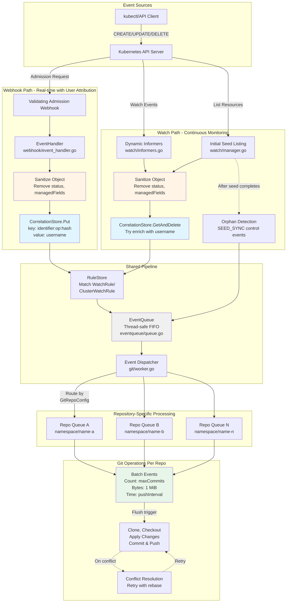

# Event Flow Architecture

This document explains how Kubernetes resource changes flow through the GitOps Reverser system, from detection to Git commits.

## Executive Summary

GitOps Reverser uses **dual-path event ingestion**:
1. **Webhook Path** (primary) - Real-time admission webhook capturing user attribution
2. **Watch Path** (continuous) - List+Watch informers for comprehensive coverage and orphan detection

Both paths converge into a shared event queue, where events are sanitized, matched against rules, and eventually committed to Git.

---

## Event Flow Diagram



---

## Detailed Component Breakdown

### 1. Webhook Path (Real-time + User Attribution)

**File**: [`internal/webhook/event_handler.go`](../internal/webhook/event_handler.go)

#### Flow:
1. **Admission Request** arrives at validating webhook endpoint
2. **Decode Object** from admission request (handles CREATE/UPDATE/DELETE)
3. **Sanitize Object** - removes `status`, `managedFields`, and sensitive data
4. **Store Correlation Entry**:
   ```go
   key = GenerateKey(identifier, operation, sanitizedYAML)
   // Format: {group}/{version}/{resource}/{namespace}/{name}:operation:contentHash
   CorrelationStore.Put(key, username)
   ```
5. **Match Rules** against WatchRule and ClusterWatchRule
6. **Enqueue Event** with full user information

#### Key Characteristics:
- ✅ **User Attribution**: Captures `req.UserInfo.Username` and `req.UserInfo.UID`
- ✅ **Real-time**: Processes events as they happen
- ✅ **Synchronous**: Returns immediately (non-blocking webhook)
- ⚠️ **Not Optional**: Required for user attribution in commits

### 2. Watch Path (Continuous Monitoring)

**Files**: 
- [`internal/watch/manager.go`](../internal/watch/manager.go) - Orchestration and seed listing
- [`internal/watch/informers.go`](../internal/watch/informers.go) - Dynamic informer handlers

#### Flow:

##### A. Initial Seed Listing (Bootstrap)
1. **Compute GVRs** from active WatchRule/ClusterWatchRule
2. **Filter Discoverable** GVRs against API server
3. **List Resources** for each GVR
4. **Sanitize** each object
5. **Match Rules** and enqueue UPDATE events
6. **Emit SEED_SYNC** control events (one per GitRepoConfig)

##### B. Continuous Watch (Runtime)
1. **Dynamic Informers** watch resources matching rules
2. **Handle Events** (Add/Update/Delete callbacks)
3. **Sanitize Object**
4. **Correlation Enrichment**:
   ```go
   key = GenerateKey(identifier, operation, sanitizedYAML)
   entry, found = CorrelationStore.GetAndDelete(key)
   if found {
       userInfo.Username = entry.Username  // Enriched!
   }
   ```
5. **Match Rules** and enqueue events

##### C. Orphan Detection
- After seed completes, `SEED_SYNC` control event triggers:
  - Compute `S_git` (files in repo) - `S_live` (observed resources)
  - Create DELETE events for orphans
  - Uncapped (per spec - Git history allows revert)

#### Key Characteristics:
- ✅ **Comprehensive**: Catches all resource changes
- ✅ **Resilient**: Continues if webhook missed events
- ✅ **Orphan Detection**: Identifies stale resources in Git
- ⚠️ **Username Enrichment**: Depends on correlation store hit (60s TTL)
- ⚠️ **Best Effort**: May not capture user for very old events

---

## Cache Architecture

### 1. CorrelationStore (Webhook→Watch Username Bridge)

**File**: [`internal/correlation/store.go`](../internal/correlation/store.go)

#### Purpose
Links webhook events (with username) to watch events (without username) using content-based keys.

#### Key Format
```
{group}/{version}/{resource}/{namespace}/{name}:operation:contentHash

Examples:
- Core namespaced: v1/configmaps/default/my-config:UPDATE:a1b2c3d4e5f67890
- Grouped cluster: apps/v1/deployments/my-app:CREATE:f0e1d2c3b4a59687
- Core cluster: v1/nodes/node-1:UPDATE:1234567890abcdef
```

Where `contentHash` = first 16 hex chars of xxhash64(sanitizedYAML)

#### Storage Structure
```go
type Store struct {
    entries map[string]*entryQueue  // key → queue of entries
    lruList *list.List              // LRU eviction order
    lruMap  map[string]*list.Element // O(1) LRU access
    ttl     time.Duration           // 60 seconds
    maxEntries int                  // 10,000 keys
    maxQueueDepth int               // 10 entries per key
}

type entryQueue struct {
    entries []*Entry  // FIFO queue
}

type Entry struct {
    Username  string
    Timestamp time.Time
}
```

#### Behavior
- **Put** (from webhook): Appends to FIFO queue per key, drops oldest if > 10 entries
- **GetAndDelete** (from watch): Retrieves and removes oldest entry (FIFO)
- **Eviction**: LRU when capacity reached, TTL cleanup every 60s
- **Rapid Changes**: Handles multiple users changing same content via queue

#### Metrics
- `correlation_entries_total` - Total entries stored
- `correlation_hits_total` - Successful enrichments
- `correlation_misses_total` - Failed enrichments
- `correlation_evictions_total` - LRU/TTL evictions

### 2. EventQueue (Unified Event Buffer)

**File**: [`internal/eventqueue/queue.go`](../internal/eventqueue/queue.go)

#### Purpose
Thread-safe FIFO queue bridging event sources to Git workers.

#### Structure
```go
type Queue struct {
    mu     sync.Mutex
    events []Event
}

type Event struct {
    Object                 *unstructured.Unstructured  // Sanitized K8s object
    Identifier             types.ResourceIdentifier    // GVR + namespace + name
    Operation              string                      // CREATE/UPDATE/DELETE/SEED_SYNC
    UserInfo               UserInfo                    // username (from webhook or correlation)
    GitRepoConfigRef       string                      // Target repo config name
    GitRepoConfigNamespace string                      // Target repo config namespace
    Branch                 string                      // Git branch
    BaseFolder             string                      // Optional path prefix
}
```

#### Operations
- **Enqueue**: Webhook and Watch paths add events here
- **DequeueAll**: Git worker dispatcher pulls all events atomically
- Thread-safe with mutex protection

### 3. RuleStore (Compiled Rule Matching)

**File**: [`internal/rulestore/store.go`](../internal/rulestore/store.go)

#### Purpose
Pre-compiled rule matchers for efficient GVR + label matching.

#### Storage
```go
type RuleStore struct {
    // Namespaced rules
    watchRules map[string][]CompiledRule  // namespace → rules
    
    // Cluster-wide rules  
    clusterRules []CompiledClusterRule
}
```

#### Matching Logic
Both webhook and watch paths use identical matching:
```go
matchingRules := ruleStore.GetMatchingRules(
    object,
    resourcePlural,
    operation,
    apiGroup,
    apiVersion,
    isClusterScoped,
)
```

---

## Git Worker Processing

**File**: [`internal/git/worker.go`](../internal/git/worker.go)

### Repository-Specific Queues

Events are routed to **per-GitRepoConfig queues** based on:
```go
queueKey = gitRepoConfigNamespace + "/" + gitRepoConfigRef
```

Each queue processes independently with its own:
- Event buffer
- Byte counter
- Timer (pushInterval)
- Commit limits (maxCommits)

### Batch Flushing (3 Triggers)

#### 1. Count-Based (maxCommits)
Default: 20 commits (configurable via `spec.push.maxCommits`)
```go
if len(eventBuffer) >= maxCommits {
    commitAndPush()
}
```

#### 2. Byte-Based (1 MiB cap - FIXED)
```go
bufferByteCount += estimateEventSizeBytes(event)
if bufferByteCount >= 1048576 {  // 1 MiB
    commitAndPush()
}
```

**Critical**: Byte size calculated from **sanitized** object:
- ✅ Status removed (doesn't count)
- ⚠️ But spec+metadata still has size
- ⚠️ Identical sanitized objects accumulate bytes

#### 3. Time-Based (pushInterval)
Default: 1 minute (configurable via `spec.push.interval`)
```go
case <-ticker.C:
    if len(eventBuffer) > 0 {
        commitAndPush()
    }
```

### Special Events

#### SEED_SYNC Control Event
- No object (nil)
- Triggers orphan detection
- Computes: S_orphan = S_git - S_live
- Creates DELETE events (uncapped)
- Resets live path tracking

---

## Status Update Handling

### Current Behavior
1. **Webhook receives** status update
2. **Sanitization removes** `status` field
3. **Correlation stored** with sanitized content (no status)
4. **Event enqueued** with sanitized object
5. **Byte size counted** for sanitized object (spec+metadata only)

### The Problem
If you receive 10 status-only updates on a 1KB ConfigMap:
- Each creates an event with identical sanitized content
- Each adds ~1KB to `bufferByteCount` (10KB total)
- May trigger premature byte-cap flush
- Creates 10 identical commits (wasteful)

### Potential Improvements
1. **Deduplication**: Skip events with identical sanitized content hash
2. **Pre-filter**: Detect status-only changes before enqueuing
3. **Batching**: Merge consecutive identical sanitized objects

---

## Event Path Decision Matrix

| Scenario | Webhook | Watch | User Attribution |
|----------|---------|-------|------------------|
| kubectl apply | ✅ Captures | ✅ Also sees | ✅ From webhook |
| Controller update | ✅ Captures | ✅ Also sees | ✅ From webhook (service account) |
| Status-only change | ✅ Captures | ✅ Also sees | ✅ From webhook |
| Missed webhook | ❌ | ✅ Catches it | ⚠️ No username (correlation miss) |
| Initial bootstrap | ❌ | ✅ Seed listing | ❌ No username available |
| Orphan detection | ❌ | ✅ SEED_SYNC | N/A (DELETE events) |

---

## Configuration

### GitRepoConfig Spec
```yaml
apiVersion: configbutler.ai/v1alpha1
kind: GitRepoConfig
metadata:
  name: my-repo
spec:
  repoURL: https://github.com/org/repo
  allowedBranches: [main]
  
  push:
    interval: "1m"        # Time-based flush
    maxCommits: 20        # Count-based flush
    # maxBytes: 1MiB      # FIXED (not configurable)
```

### WatchRule/ClusterWatchRule
Determines which resources flow through the system:
```yaml
apiVersion: configbutler.ai/v1alpha1
kind: WatchRule
metadata:
  name: watch-configmaps
spec:
  gitRepoConfigRef: my-repo
  resources:
    - group: ""           # Core group
      version: v1
      resource: configmaps
  operations: [CREATE, UPDATE, DELETE]
```

---

## Testing the Event Flow

### 1. Webhook Path Only
```bash
kubectl apply -f configmap.yaml
# Check correlation store hit in logs
```

### 2. Watch Path Only  
```bash
# Disable webhook temporarily
kubectl label namespace default gitops-reverser-webhook=disabled

# Direct API update (bypasses webhook)
kubectl patch configmap my-cm --type=merge -p '{"data":{"key":"value"}}'
# Watch should catch it (correlation miss - no username)
```

### 3. Orphan Detection
```bash
# Create resource
kubectl apply -f resource.yaml

# Wait for seed cycle (or trigger reconciliation)
# Delete from cluster but not Git
kubectl delete -f resource.yaml --wait=false

# SEED_SYNC will detect orphan and create DELETE event
```

---

## Performance Considerations

### Webhook Path
- **Latency**: <10ms typical (non-blocking)
- **Scale**: Handles cluster-wide admission traffic
- **Bottleneck**: None (async enqueue)

### Watch Path
- **Latency**: Watch delay + processing (<1s typical)
- **Scale**: Proportional to GVR count × object count
- **Bottleneck**: Initial seed listing on large clusters

### Correlation Store
- **Capacity**: 10,000 keys × 10 entries/key = 100,000 entries max
- **TTL**: 60 seconds (tune for watch delay)
- **Memory**: ~10 bytes/entry × 100k = ~1 MB

### Event Queue
- **Unbounded**: Can grow indefinitely if Git workers lag
- **Backpressure**: None (consider adding)
- **Metrics**: `repo_branch_queue_depth` tracks growth

---

## Troubleshooting

### Missing Username in Commits
**Symptom**: Git commits show empty or system username  
**Cause**: Correlation miss (watch event didn't find webhook entry)  
**Solutions**:
- Increase correlation TTL if watch lag is high
- Check webhook is receiving events
- Verify sanitization produces identical content hash

### Duplicate Commits
**Symptom**: Multiple identical commits for same resource  
**Cause**: Status-only updates or rapid changes  
**Solutions**:
- Implement deduplication based on content hash
- Filter status-only changes earlier in pipeline

### Orphan Detection Not Working
**Symptom**: Stale files remain in Git after resource deletion  
**Cause**: SEED_SYNC not triggered or seed listing incomplete  
**Solutions**:
- Check seed listing logs for errors
- Verify GVR discovery succeeded
- Ensure GitRepoConfig is correctly referenced

---

## Future Enhancements

1. **Smart Deduplication**: Skip events with identical sanitized content
2. **Backpressure**: Limit event queue growth when Git workers lag
3. **Selective Status Tracking**: Allow opt-in status field preservation
4. **Multi-Cluster**: Aggregate events from multiple clusters
5. **Event Prioritization**: Critical resources bypass batching