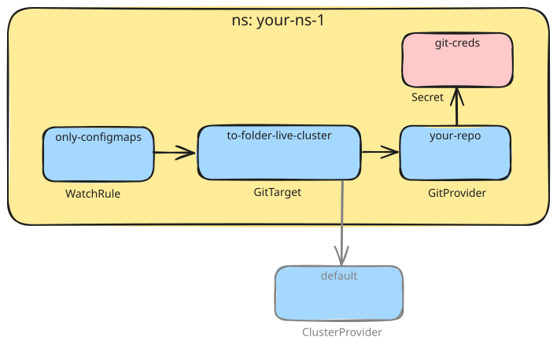

# Quick start

Use a lab cluster and a disposable repository for this demo. It creates a starter `GitProvider`,
`GitTarget`, and `WatchRule` in the `gitops-reverser-quickstart-demo` namespace, watching ConfigMaps
there and writing them to
`<your-repo>/live-cluster` on `main`. It runs in `configured-author` mode (no Redis) by default. The
chart also renders the cluster-scoped `default` `ClusterProvider` the starter target resolves against.



**Prerequisites:** a Kubernetes cluster with `kubectl`, Helm 3, and cert-manager for TLS.

To write the objects yourself instead of letting the chart generate them, start from
[`config/samples/`](../config/samples/): one manifest per object, consistent enough to apply
together. [`configuration.md`](configuration.md) explains every field.

## 1. Install cert-manager

Skip this step if cert-manager is already installed and healthy.

The controller mounts an admission certificate at startup, so cert-manager must be healthy *before*
you install the chart. (`--set servers.admission.enabled=false` drops the dependency; the
[chart README](../charts/gitops-reverser/README.md) covers bring-your-own certificates.)

```bash
kubectl apply -f https://github.com/cert-manager/cert-manager/releases/download/v1.21.0/cert-manager.yaml
kubectl wait --for=condition=ready pod -l app.kubernetes.io/instance=cert-manager -n cert-manager --timeout=300s
```

## 2. Create a Git repo and a deploy key

Create an (empty) repository the operator will write to, then generate a key. Add the public half as a
**deploy key with write access**; the private half becomes the Secret in the next step:

```bash
ssh-keygen -t ed25519 -C "gitops-reverser@cluster" -f /tmp/gitops-reverser-key -N ""
# Add /tmp/gitops-reverser-key.pub to your Git provider as a deploy key (write access)
```

## 3. Create the demo namespace and Git credentials

Do this **before** installing. The starter `GitProvider` is only re-checked about every 5 minutes, so
if the Secret is missing at install time your first commit can be minutes late; having it ready up
front lets the starter resources go Ready on the first reconcile:

```bash
kubectl create namespace gitops-reverser-quickstart-demo \
  --dry-run=client -o yaml | kubectl apply -f -

kubectl create secret generic git-creds \
  --namespace gitops-reverser-quickstart-demo \
  --from-file=ssh-privatekey=/tmp/gitops-reverser-key \
  --from-literal=known_hosts="$(ssh-keyscan github.com 2>/dev/null)" \
  --dry-run=client -o yaml | kubectl apply -f -
```

SSH host-key verification fails closed, so the `known_hosts` line is required.

`ssh-keyscan` trusts whatever answers on the network, so it pins whichever key it is handed. Check
what you got against the fingerprints GitHub publishes at
[GitHub's SSH key fingerprints](https://docs.github.com/en/authentication/keeping-your-account-and-data-secure/githubs-ssh-key-fingerprints)
before you rely on the Secret:

```bash
ssh-keyscan github.com 2>/dev/null | ssh-keygen -lf -
```

They are printed rather than pinned here on purpose: GitHub has rotated a host key before, and a
fingerprint copied into a guide goes stale silently while a link does not. Existing Flux or Argo CD
credentials Secrets are accepted as-is (they must have **write** access). See
[`configuration.md`](configuration.md) for accepted Secret shapes and
[`github-setup-guide.md`](github-setup-guide.md) for the full GitHub guide and HTTPS/PAT
fallback.

## 4. Install GitOps Reverser with the demo enabled

Point the starter `GitProvider` at your repo and install:

```bash
helm install gitops-reverser \
  oci://ghcr.io/configbutler/charts/gitops-reverser \
  --namespace gitops-reverser \
  --create-namespace \
  --set quickstart.enabled=true \
  --set-string quickstart.gitProvider.url=git@github.com:OWNER/REPO.git
```

Replace `OWNER/REPO` with your repository (angle brackets would be parsed by the shell).

This install has these defaults:

- **No Redis**, so warm-restart cursors and author capture stay inactive. Add one with
  `--set queue.redis.addr=HOST:PORT` (plus `queue.redis.auth.existingSecret` if it needs auth).
- **Cluster-wide read on every watchable type, including Secrets** (`rbac.watchTypes.mode=any`).
  [`rbac.md`](rbac.md) explains how to narrow it.
- **SOPS is on for the starter target**, so a `sops-age-key` Secret is generated in the demo namespace
  with a backup reminder. Only matters once you mirror Secrets; back it up if you keep the demo.

Wait for the controller. On a fresh install this waits on cert-manager issuing the certificate:

```bash
kubectl rollout status deployment/gitops-reverser -n gitops-reverser --timeout=300s
```

Then check the starter resources:

```bash
kubectl get gitprovider,gittarget,watchrule -n gitops-reverser-quickstart-demo
```

The `GitProvider` and `WatchRule` report `Ready=True`; the `GitTarget` reports **`Validated=True`**.
Its aggregate `Ready` stays `Unknown` until first source discovery, which is the expected state.

## 5. Test it

```bash
kubectl create configmap test-config --from-literal=key=value -n gitops-reverser-quickstart-demo
```

A new commit should land in your repository within seconds. If none appears:

```bash
kubectl logs -n gitops-reverser deploy/gitops-reverser
kubectl describe gitprovider,gittarget,watchrule -n gitops-reverser-quickstart-demo
```

Two `GitTarget` conditions stop the data plane and are worth recognizing: `ClusterProviderNotFound`
(the `default` `ClusterProvider` is missing) and `NamespaceNotAuthorized` (its `accessFrom`
selector does not cover the demo namespace).

## Clean up

To tear the demo down: `helm uninstall gitops-reverser -n gitops-reverser` and
`kubectl delete namespace gitops-reverser-quickstart-demo`.

> **Note:** the `default` `ClusterProvider` is cluster-scoped and chart-owned, so uninstalling takes
> it with it, holding *every* other `GitTarget` in the cluster unready. Mind that if you run the demo
> alongside a real deployment.

## Want named users on your commits?

Enable audit attribution to use the Kubernetes actor as the Git author while keeping the
committer unchanged. The [attribution setup guide](attribution-setup-guide.md) covers receiver
configuration, API server delivery, and verification. It requires control over kube-apiserver settings.
