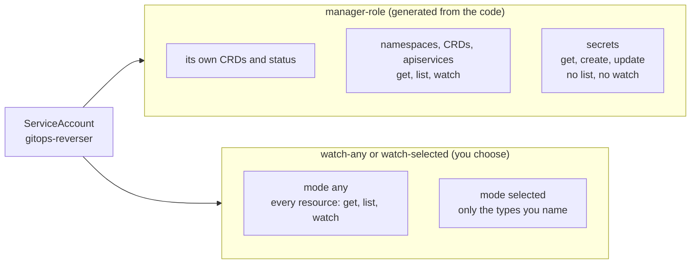
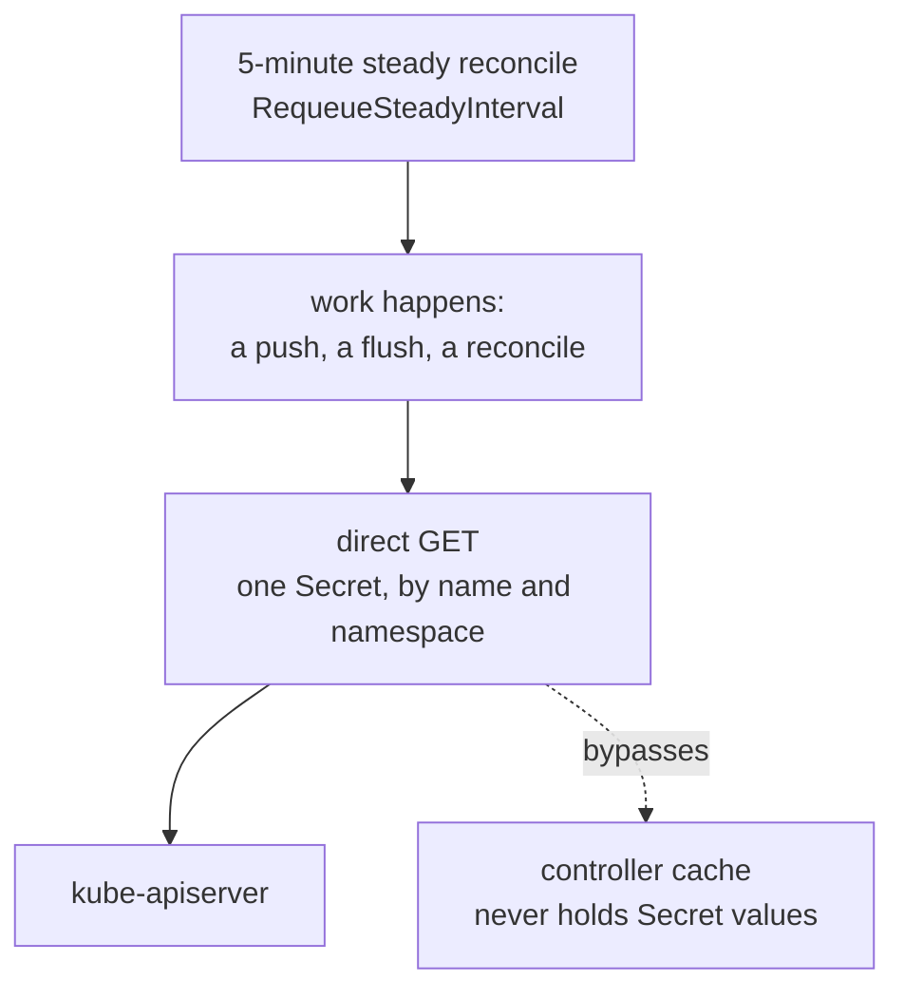

# Security Model

What GitOps Reverser can access, why, and which pieces are sensitive. Read this before installing.

## What the controller is allowed to read

The ServiceAccount is bound to **two** ClusterRoles, and keeping them apart is the whole point:
Kubernetes RBAC is additive, so a wildcard read folded in beside a narrow Secret rule silently
widens it.

To mirror live state into Git the controller must:

- **Read the watched types.** `WatchRule`/`ClusterWatchRule` pick them; the controller needs
  `get,list,watch` on each. `rbac.watchTypes.mode: any` grants that for every type at once —
  convenient, and it means the reverser can enumerate **every Secret in the cluster**. `mode:
  selected` grants only the types you name. See [`rbac.md`](rbac.md).
- **Read referenced Secrets.** The git-creds Secret, and the SOPS/age key Secret when encryption
  is configured, both named by a `GitProvider`/`GitTarget`. This is a `get` by name — never a
  `list` or a `watch`.
- **Receive audit events.** The kube-apiserver audit webhook posts events to the audit ingress.
  Those carry object metadata and, for some resources, request/response bodies.

The controller never writes to a watched type. Its only write target is Git, plus the Secrets it
generates itself (the signing key, and the age key under `generateWhenMissing`).

### Which namespaces a rule may read from

RBAC above is the hard maximum; *within* it, scope is carried by the rule **kind**:

- A **`WatchRule`** selects namespaced resources. Each `spec.rules[]` item watches the rule's own
  namespace by default. Naming any other source namespace — including `sourceNamespace: "*"` —
  requires both `ClusterProvider.spec.allowSourceNamespaceOverride` (a platform-admin delegation,
  false by default) and an explicit `GitTarget.spec.allowedSourceNamespaces` entry admitting it. A
  `"*"` expands to exactly that policy's set, never to every namespace that exists.

  On an **in-cluster** provider that delegation deliberately bypasses live namespace RBAC: the owner
  of an admitted `GitTarget` can then mirror another namespace's objects — read through the
  operator's own cluster-wide credential — into a Git destination they control. That is legitimate to
  grant on purpose, and it is why the flag exists and defaults to false.
- A **`ClusterWatchRule`** selects cluster-scoped resources only. Cluster-scoped objects have no
  namespace, so `allowedSourceNamespaces` is neither consulted nor a bound for it: it is
  intentionally cluster-global. Isolating cluster-scoped objects between tenants therefore takes a
  separate `ClusterProvider` and credential per tenant, so that credential's RBAC is the boundary.

The audit question is one per kind: read a `WatchRule`'s items and its target's policy, or recognise
a `ClusterWatchRule` as cluster-global.

## The controller does not hold Secret values

There is **no Secret informer**. The manager is built with `Client.Cache.DisableFor:
corev1.Secret` ([`cmd/main.go`](../cmd/main.go)), so a typed Secret read bypasses the cache and
goes straight to the API server. No control-plane Secret watch exists; the `GitTarget` one was
removed.

The trade is deliberate: no instant reaction to a rotated credential, in exchange for a process
that cannot leak Secret values it was never asked to hold. A rotated git credential or age key is
picked up by the next direct read when work happens, and at the latest by the 5-minute reconcile.

This is why the manager role asks for `secrets: get, create, update` and nothing more — the
runtime genuinely does not need `list` or `watch`. What it does **not** do is scope those verbs to
a namespace: a `GitProvider` may reference a Secret anywhere, so the grant is cluster-scoped. A
`selected` install therefore cannot *discover* a Secret, but can still read one whose name and
namespace it already knows. Narrowing that further is
[remaining work](future/least-privilege-remaining-work.md).

## Sensitive trust boundaries

| Boundary | Why it matters |
|---|---|
| Git credentials Secret | Grants push access to your repository. |
| SOPS/age key material | Decrypts (and the public key encrypts) Secret data written to Git. |
| Redis/Valkey queue | Buffers decoded audit events in transit; not an audit archive. |
| Audit ingress (`/audit-webhook`) | Accepts audit traffic; protected by mutual TLS via cert-manager. |
| Generated Secret material | Signing keys and generated age keys live in cluster Secrets. |

## Secret data the controller writes to Git

Without encryption, a watched `Secret` is committed as-is (its data is plain in the repository). With
SOPS + age (`GitTarget.spec.encryption`), Secret values are encrypted before commit using the age
recipients, and the private key never leaves the cluster.

The write path **only encrypts** — nothing in the operator decrypts Git content — so it needs
**public age recipients only**. Concretely: no private identity is written to disk, `SOPS_AGE_KEY_FILE`
is never set, and Secret `data` is never handed to the `sops` process as environment. That holds even
when the recipient is derived from a cluster age-key Secret, which the controller reads once to take
the public half.

So: only watch `Secret` types you intend to commit, and prefer encryption. Secret-shaped custom
resource types can opt into the same encryption path at controller startup. See
[`sops-age-guide.md`](sops-age-guide.md).

## Git credentials Secret shape

`GitProvider.spec.secretRef` points to a namespace-local Secret. The controller picks the auth
method from the keys present, preferring an SSH key, then HTTP basic auth, then a bearer token. The
examples below use the Kubernetes-native key names; the reader also accepts the Flux and Argo CD key
names so an existing GitOps Secret works unchanged (see
[`design/git-credentials-interop.md`](finished/git-credentials-interop.md)).

### HTTPS (basic auth)

| Key | Required | Notes |
|---|---|---|
| `username` | yes | Git username. |
| `password` | yes | Token or password. |

### HTTPS (bearer token)

| Key | Required | Notes |
|---|---|---|
| `bearerToken` | yes | OAuth/PAT bearer token; sent without a username (GitHub fine-grained PAT, GitLab access token). |

### SSH

| Key | Required | Notes |
|---|---|---|
| `ssh-privatekey` | yes | PEM-encoded private key (also read from Flux `identity` / Argo `sshPrivateKey`). |
| `ssh-password` | no | Passphrase for the private key, if any (also read from `password`). |
| `known_hosts` | conditional | Host key(s) for the Git server. SSH fails closed unless host keys are supplied by some source. |

Host key verification is enforced by default and fails closed. Host keys are resolved in priority
order: the Secret's own `known_hosts`, then `GitProvider.spec.knownHostsRef` (a namespace-local
ConfigMap/Secret), then an install-level default known-hosts ConfigMap in the controller's namespace
(`--default-known-hosts-configmap`). A `known_hosts` that is present but unparseable is always a hard
error. The controller flag `--insecure-allow-missing-known-hosts` disables verification **only** when
no source provided any host keys at all, and is for throwaway/development clusters only.
