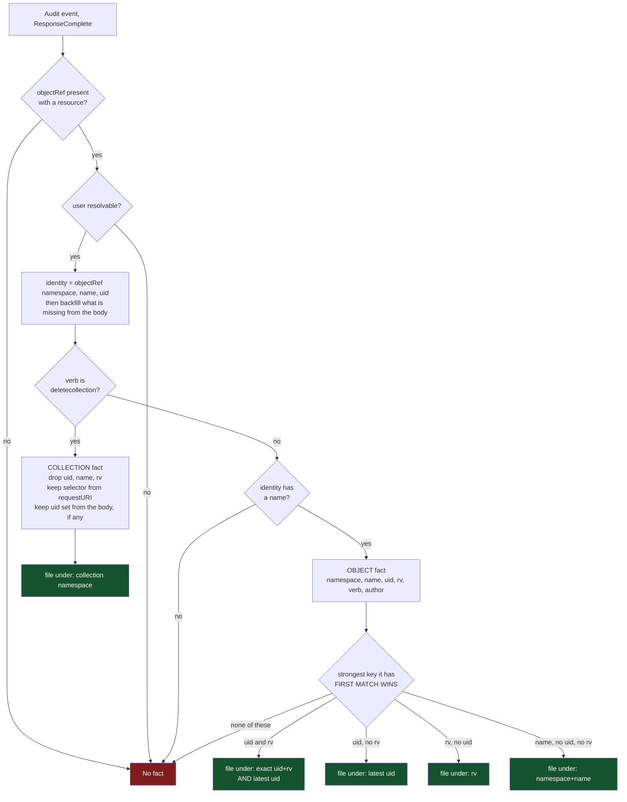
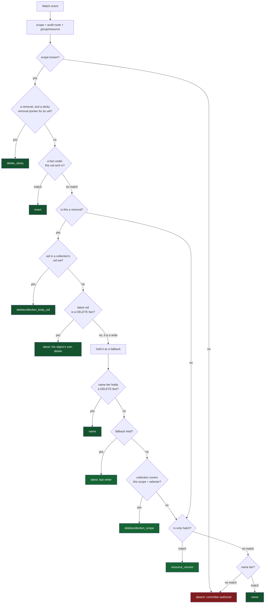
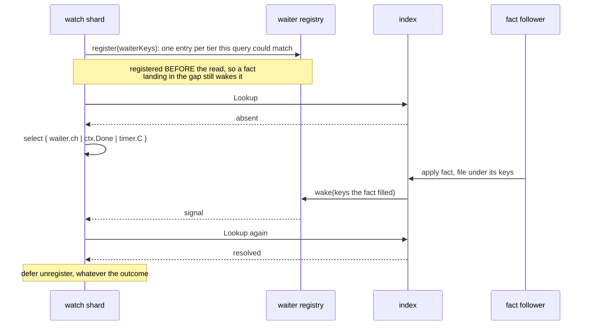
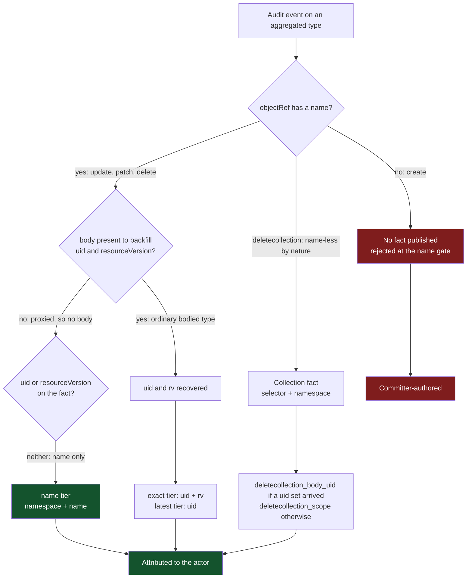

# Attribution: how a commit gets its author

> **spec**: current behavior. The code depends on this document; change one, change the other.
> Index: [`../INDEX.md`](../INDEX.md)
>
> This is the single reference for attribution. It replaces six design records that each described
> one part of it while it was being built: the publish/join reference, the fact-identity proposal,
> the deletion-intent-actor fix, the switchover findings, the metric-surface proposal, and the
> `deletecollection` expander spec whose subject no longer exists. Their reasoning is in
> `git log`; the one record kept in full is
> [`../finished/attribution-fact-stream.md`](../finished/attribution-fact-stream.md), which argues
> why facts are a per-type stream rather than a keyspace.
>
> What is still **open** is not here. It is ranked in
> [`../design/open-asks-priority.md`](../design/open-asks-priority.md), and the one decision with
> its own record is [`../design/attribution-removal-wait-options.md`](../design/attribution-removal-wait-options.md).
>
> Related: [`../facts/watch-event-ordering-and-attribution-grace.md`](../facts/watch-event-ordering-and-attribution-grace.md),
> [`commitrequest-admission-authorship.md`](commitrequest-admission-authorship.md),
> [`../attribution-setup-guide.md`](../attribution-setup-guide.md),
> [`../interpreting-metrics.md`](../interpreting-metrics.md).

## The shape: two halves that never call each other

Attribution has two halves. One turns an audit event into a **fact**; the other turns a watch event
into an **author** by finding a fact. They meet only in the index, through the keys a fact was filed
under.

**Neither half branches on the type.** Every decision is made on the **verb** of the request and on
which fields the event happens to carry. Why that is a requirement rather than a coincidence is
[no branch depends on the type](#no-branch-anywhere-depends-on-the-type).

The governing rule, which every choice below defers to: **a wrong author is worse than no author.**
When no usable fact is found the commit ships with the explicit unresolved author
(`unknown (attribution unresolved)`), never with a guess.

## 1. Deletion is attributed at intent time

This is a render-layer rule rather than an attribution mechanism, and it comes first because
everything about attributing a removal depends on it.

Deletion is two distinct facts, and conflating them is what made an earlier design hard:

- **Deletion intent.** The API server accepted a `DELETE` or `DELETECOLLECTION` and marked the object
  with `deletionTimestamp`. The object's *desired* existence is now absent.
- **Final removal.** The object disappeared from the API after grace and finalization
  completed. That is runtime cleanup, and it can take five seconds or three days.

The Git manifest we commit is meant to be re-applied, and it already strips `deletionTimestamp`
and `deletionGracePeriodSeconds` ([`sanitize.go`](../../internal/sanitize/sanitize.go)) because they
are server-owned runtime metadata, not desired state. If those fields are not desired state, then an object that *only*
differs by having them is, as desired state, gone.

> **A resource with `deletionTimestamp` set is treated as logically absent from the intent tree.**
> The first observation of `deletionTimestamp` (or a `DELETED` event) removes the resource from Git
> and attributes the removal to the actor who **requested** the deletion. Later finalizer updates and
> the eventual `DELETED` event do not create additional Git changes; they are runtime cleanup,
> observed operationally only.

So when Alice runs `kubectl delete widget foo`, the Git change is `- widgets/foo.yaml`, authored
"Alice", now. It is not a commit that sets `deletionTimestamp` on the file, and not a commit
deferred until finalization finishes.

**Why this is correct rather than a shortcut.** It does not bypass finalizers: removing the file is a
statement about desired state, not an act on the cluster, and the object stays in `Terminating` until
its controllers are done. `deletionTimestamp` is monotonic and terminal, so "logically absent" can
never flip-flop. And the repository's invariant stays clean: **a file present means the resource is
intended to exist.**

**Why immediate removal is the reversible default.** Richer behavior can be added on top of that
invariant later: `.deletions/` records, commit-message trailers, status reporting. The reverse is
much harder: if `Terminating` objects stayed in the main tree, consumers would learn that "file
exists implies object still in the API", and removing them later would silently change what the
repository means.

**In code.** [`routeLiveTargetWatchEvent`](../../internal/watch/target_watch.go) routes an event
whose object has `GetDeletionTimestamp() != nil` as a **Delete** regardless of whether the watch type
is `MODIFIED` or `DELETED`; the Delete path emits no body, so the file is removed. This is computed
*before* the operation is matched against the rule's verbs, so a WatchRule that excludes deletes
consistently does not act on the logical delete either. Later finalizer-clearing events re-issue
"delete X" against an already-absent path, and the writer diffs them to a no-op.

**One operational caveat.** Logical absence is a Git statement, and it must not make us blind to a
stuck deletion. A long-`Terminating` object is surfaced through status, metrics and diagnostics,
never by keeping its desired-state file. Recording *who cleared the finalizer* is legitimate as a
diagnostic signal, and never as the Git author.

## 2. The publish side: audit event to fact

One audit event in. Zero or one fact out, filed under one to three keys.



Two gates drop an event entirely: no resource, and no resolvable name on a non-collection verb. A
collection request is exempt from the name gate because it names no object by nature, and that is
the one place the verb changes which gate applies.

A third gate is the fact's whole reason to exist: **no resolvable user, no fact**. It is the one
field the wire contract requires, and the read side enforces it too. `AuthorFact.UnmarshalJSON`
refuses an entry naming nobody, which lands on
`gitopsreverser_attribution_fact_stream_decode_errors_total` rather than being half-absorbed. So a
fact in the index always names an actor, and the metrics can read attribution coverage off the tier
alone. The event that produced no fact is not lost either: it is counted `no_attribution_fact` on
`audit_events_total`, where its type and verb are still in hand.

The body backfill is why the name gate is survivable. `objectRef` alone often lacks the name or the
uid; `IdentityFromAuditEvent` fills what is missing from the request or response object, preferring
the request object for a delete and the response object otherwise. What the event carries in its body
therefore decides which keys the fact ends up with, and the type has nothing to do with it.

### Filing picks one branch

The fact keeps every field it recovered, but it is **filed** under one branch only. `file` is a
switch on the strongest key present, and the first matching case wins: a fact with a uid is not also
filed under its name or its resourceVersion, even though it has them.

The reason is memory. A watch event always knows its object's uid, so it always asks a uid tier
first, and a uid-keyed fact always answers there. A second copy of that same fact under its name
would never be the one read. Storing it anyway costs the entry on every replica following the type,
for the whole TTL, and again on every restart replay, and buys nothing.

The one branch that files more than once is the uid case: `exact` (when the fact also has a
resourceVersion) serves creates and updates, `latest` serves removals, and the two answer different
questions about the same object. A fact whose own verb is a **removal** takes a third structure, the
sticky removal pointer, which answers a question no later fact can: who asked for the deletion.

So the rule is: keep every field, file under exactly the keys a query could reach you by.

### A collection delete is one fact

`kubectl delete configmaps --all -n team-a` produces **one** name-less `deletecollection` audit
event, while the watch delivers **N** independent events, one per object. State is correct with no
special code. Attribution is not free, and it is served by publishing one fact that describes the
**collection** (actor, type, namespace, the selector the request URI expressed, the stage timestamp,
and the set of uids the API server named when it sent a body), which every removal in that scope
joins.

**A collection member must join by uid, not by resourceVersion.** The watch event that removes the
file carries the object's current RV (the RV the deletion stamped), while the response body lists
each removed object at its **pre-delete** RV, a different number for the same object. The only field
stable and identical on both sides is `metadata.uid`. That is why the uid tier sits above the scope
tier.

**When there is no body**, the join proceeds on scope alone: namespace, selector and window. An
aggregated or external API server, a `Metadata`-level policy, or
`--audit-webhook-truncate-enabled` can all report a collection delete with no usable list. Scope
matching would be dangerous if it were unbounded, and three things bound it:

- **Namespace and selector narrow it.** The selector is the intent the actor *stated*, read off the
  request URI, and it is present even when the body is not. An empty selector matches everything of
  the type in the namespace, which is exactly what `--all` means.
- **Precedence keeps anything with its own fact out.** The scope tier is the weakest evidence the
  join has, so it is reached only when every more specific tier missed. An unrelated
  `kubectl delete configmap x` in the same window is claimed by its own fact and never reaches it.
- **The window is short**, because of the intent rule in §1. The removal happens at delete-request
  time, so the window only has to cover audit batching plus clock skew:
  `--author-attribution-collection-window`, 30s by default, against a fact TTL of ten minutes.
  Attribution chasing the eventual removal could not have offered that.

The result is the reverse of a degradation: the cases most likely to send no body are the ones that
gain most.

## 3. Where the facts live

### The scope is an audit route and a type

Facts are partitioned by `factScope{route, groupResource}`. Both halves are load-bearing.

**The route** is where a cluster's audit events arrive, and it is **declared** rather than inferred
from an object's name:

```yaml
apiVersion: configbutler.ai/v1alpha3
kind: ClusterProvider
metadata:
  name: tenant-acme-delegating   # the name humans read and GitTargets reference
spec:
  attribution:
    auditRoute: prod-eu-1        # the route this cluster's audit events arrive on
```

`spec.attribution.auditRoute` is the `<name>` segment the API server's webhook URL ends in
(`/audit-webhook/<name>`), or (when several logical clusters share one backend) the value of the
audit-event annotation named by `--author-attribution-audit-route-annotation-key`. It defaults to
`metadata.name` through [`ClusterProvider.AuditRoute()`](../../api/v1alpha3/clusterprovider_types.go),
so no caller sees the empty case and every single-provider install keeps working unchanged.

It exists because an API server posts audit to exactly **one** route. Several `ClusterProvider`s may
name one physical cluster, and without a declared route only one of those names is ever fed while
every other one authors `unknown (attribution unresolved)`. Carrying the same route lets them share
one cluster's facts; carrying different routes means a fact from cluster A can never name the author
of an object watched on cluster B, which is also what keeps a cloned or restored cluster separate
from its origin. It is **mutable**, unlike `spec.kubeConfig`: repointing it changes which partition
is read, not which cluster is mirrored, so correcting a typo does not require deleting the object.

Ingestion makes **no Kubernetes API call**. The route is a partition name rather than a claim about
an object that must exist, so an audit batch that arrives while a provider is being created is
stored rather than 404'd (the API server does not retry a 404). The authentication boundary is
unchanged and lives elsewhere: the audit server requires a client certificate signed by the audit CA
(`RequireAndVerifyClientCert`). The existence check was never an authorization check; see
[`../design/multi-source-audit-ingress-hardening.md`](../design/multi-source-audit-ingress-hardening.md),
which owns the remaining ingress work.

**A misrouted provider is loud.** The resolver tracks, per route, whether attribution has ever
resolved and how many events have gone unresolved since. A route that has never resolved and produces
five unresolved events in a row logs once, naming the fix rather than the symptom. The threshold is
not one because a lone miss is ordinary; a run of them with nothing ever matched is the signature of
a route nobody writes to. One line per route per process, because the condition is a configuration
mistake and repeating it per event would bury it.

**The type** suffix is what makes the fan-out meaningful: a process watching only `configmaps` and
`deployments` follows two streams and never receives a fact for anything else. It is a **partition**
and never a decision: no code reads it to choose a behavior.

### The stream, and the index

One stream per `(audit route, group/resource)`:

```text
gitops-reverser:author:v2:audit:route:<route>:<group/resource>
```

The audit receiver decodes one `EventList` per request and appends **one batched entry per type**.
Every process issues a single blocking read across every stream in its subscription set, with a
per-stream cursor held in memory, and applies what it reads into a bounded in-memory index. There are
**no consumer groups**: a consumer group distributes entries between consumers, and this is a
fan-out, and every process watching a type needs every fact for that type. The subscription set changes
at runtime as WatchRules start and stop covering types, and the reader re-issues within one block
period rather than tearing the connection down.

Retention is the TTL. Each append carries a `MAXLEN` bound so a hot type cannot grow without bound,
and a periodic trim drops entries past the retention horizon. `--author-attribution-ttl` (ten
minutes) bounds stream retention and the in-memory index together. **Expiry is decided on read**, so
an aged-out fact is never joined merely because the sweep has not run; the sweep bounds memory, never
correctness. A trim gap is reported only when the follower was behind, so ordinary ageing
of an entry a caught-up follower already read is not counted as loss.

The index is bounded by `--author-attribution-max-facts` and
`--author-attribution-max-facts-per-type`, and evictions are counted. A restart re-warms from one
TTL of stream retention rather than starting blind, which is what makes a rolling upgrade safe.

### The transports

The transport sits behind a two-method seam (`FactPublisher` / `FactFollower`) with one conformance
suite over both implementations. `--author-attribution-transport=redis` is the default;
`memory` runs attribution entirely in-process with no Redis, and is **refused with more than one
replica**. Nothing in the downward API reports a Deployment's replica count, so the chart templates
`--replica-count` in from `.Values.replicaCount`, and the chart's own guard fails a multi-replica
install with the in-memory transport outright.

`gitopsreverser_attribution_transport_info{transport}` says which contract the other metrics are
being read under.

## 4. The join side: watch event to author

One watch event in. It asks the index for the strongest fact about this object, waiting up to the
grace for one to arrive.



### The tiers, strongest first

| Tier | Key | `tier` label | What it asserts |
|---|---|---|---|
| delete, sticky | uid (a delete fact, sticky) | `delete_sticky` | who asked for this object's deletion |
| exact | uid + rv | `exact` | this actor produced this exact version |
| collection uid | uid in a collection's set | `deletecollection_body_uid` | the API server said this request deleted this object |
| latest, delete | uid | `latest` | this object's own delete fact |
| name, delete | namespace + name | `name` | this object's own delete fact, when it has no uid |
| latest, write | uid | `latest` | who last wrote it; a fallback for a removal |
| collection scope | namespace + selector + window | `deletecollection_scope` | a collection request covering it was made |
| rv-only | rv | `resource_version` | a fact with an rv but no uid |
| name | namespace + name | `name` | the only key an aggregated write has |
| absent | none | `absent` | committer-authored |

Who the evidence named is the separate `actor_kind` label (`user` / `serviceaccount` / `none`), so
every row above can be asked about either kind of actor. `tier` names the evidence and `actor_kind`
matches how `commits_total` already models the same distinction; an earlier `result` label conflated
the two and is gone (migration in [`../UPGRADING.md`](../UPGRADING.md)).

### Three rules that are easy to miss

**A fact about a DELETION may not be replaced by a fact about a WRITE.** Every ordinary structure
here is last-writer-wins, and a finalizer patch's fact carries the resourceVersion the **deletion**
stamped, so it lands under the deleter's exact key and the deleter's uid key alike. That used to
attribute a finalized deletion to the cleanup controller rather than to the human who asked for it.
A removal fact therefore also takes a **sticky removal pointer**, keyed by uid, that only another
removal fact may fill, and a removal consults that pointer before the exact tier. It is the one
structure the TTL does not bound: a uid is unique across space and time, so the statement can never
be superseded, and its horizon is the index's caps instead. It is strictly uid-keyed, because the
same stickiness on the name tier would be a defect: a name is reused after a delete and recreate.

**A removal never returns on a write fact without looking further.** The per-object tiers are
last-writer-wins, so for a removal they hold whoever last **edited** the object, which is not who
deleted it. Such a match is held as a fallback while the search continues, and the caller keeps
waiting for delete evidence until the grace expires. A fact about the deletion, filed under any key,
ends the wait immediately. Waiting never costs an attribution: the worst case returns exactly what
returning early would have returned, one grace later.

**An exact-capable event may not fall through to the removal tiers.** A create or update presents the
resourceVersion its own write produced. If the exact tier misses, the `latest` pointer may name an
older, different author, so the lookup skips straight to the rv hatch and the name tier. The gate is
one-directional, and only one of the two tiers is gated: the exact tier is tried for *any* query
carrying a uid and a resourceVersion, a removal included. What an exact-capable event may not do is
the reverse, reaching the tiers below.

### The wait

The two halves are racing, and the watch side reliably wins. The API server batches audit deliveries
(`--audit-webhook-batch-max-wait`), while the watch event is streamed, so by the time a watch event
needs an author its fact is usually still inside the batch window. The first lookup is a
near-guaranteed miss. That is the whole reason a grace window exists
(`--author-attribution-grace`, 3s by default).

So the resolver does not ask repeatedly. It arms a signal, looks once, and then sleeps until either a
fact that could match it arrives or the grace runs out.



Registering **before** the read is what closes the race a poll loop can only paper over by looking
again: a fact delivered between the register and the read wakes a waiter that is already listening.
There is no Redis call on this path. The fast case is a map read; the waiting case is a channel
receive.

The registry is `map[factWaiterKey]map[*factWaiter]struct{}`: candidate key to the set of resolvers
blocked on it. That shape is the fan-out. One resolver registers under **several** keys, one per tier
its event could resolve through, and one applied fact wakes every resolver registered under any of
the keys that fact filled. It is a many-to-many join done through an index rather than a broadcast,
so a fact never touches a resolver it could not have answered.

Four details do real work:

- **`chan struct{}` with buffer 1.** The signal carries no payload, because the payload is the index
  itself: the woken resolver re-reads it. Buffering one means a signal sent while the resolver is
  mid-recheck is still there when it comes back around, so it is not lost.
- **Non-blocking send.** `wake` does `select { case ch <- struct{}{}: default: }`, so the goroutine
  applying facts is never slowed by a resolver that has not looked yet, and a second signal on an
  already-signaled waiter is dropped. One pending wake-up is enough, because the resolver re-reads
  everything rather than consuming a queue of events. It also makes the send safe to do while holding
  the registry lock, since it cannot block.
- **`select` on three cases.** The resolver waits on the waiter, `ctx.Done()`, and the grace timer
  together, so shutdown and the deadline are not special paths.
- **`defer unregister`.** Registration is undone on every exit, including the ones that return early.
  The registry exposes a `len()` purely so a test can assert a resolver left nothing behind.

The loop around the `select` matters too, because a wake-up is only a hint. The resolver re-runs the
whole lookup, and if what arrived was not good enough (a write fact when it needs delete evidence) it
keeps waiting rather than treating the signal as a result.

**The wait blocks its shard.** `attachAuthor` runs on the watch shard's own goroutine and a shard
processes its events serially, so a removal that waits out its grace is head-of-line blocking for
every later event of that type: the commit window for a subsequent write cannot open until its event
is processed. This is a known, measured limitation rather than a subtlety: three removals in one e2e
run spent 20.18s between them, and a Deployment create queued behind them opened its window about
ten seconds late. The lookup-ordering half of that is fixed (it is what the sticky pointer and the
tier ordering did); the structural half is open, and both it and the question of when a removal
should stop waiting are ranked in
[`../design/open-asks-priority.md`](../design/open-asks-priority.md).

## No branch anywhere depends on the type

Verified across the whole path: `internal/queue`, `internal/auditutil`, and the resolver contain no
comparison against a group, a resource, a kind or an API version. The only `Resource ==` in the path
is `Resource == ""`, a presence check.

Everything dispatches on one of three things:

- **the verb**: `deletecollection` publishes a collection fact, and `delete` plus `deletecollection`
  are what `isRemovalVerb` recognizes as evidence about a deletion;
- **the operation kind**: `ExactCapable` is false for a removal, which is what unlocks the weaker
  tiers;
- **which fields are present**: uid, resourceVersion, name, request body, response body.

**This is a requirement, not an accident**, and the corpus proves it. Two ConfigMap deletes, same
cluster, same type, same verb, different shapes: in `configmap/finalizer-delete/` the response object
is the ConfigMap, so the uid is recoverable and the fact lands on the uid tiers; in
`configmap/owner-ref-cascade/` the response object is a `Status`, so there is no uid anywhere and the
fact's only key is its name. A rule of the form "ConfigMaps behave like this" cannot express that,
because the difference is not a property of ConfigMaps. It is a property of the individual request,
decided by propagation policy and by what the API server chose to return.

The same principle is what makes aggregated APIs work without ever being mentioned in the code. A
flunder is not special-cased anywhere; it produces events with no uid, and the shape-driven rules
route it to the name tier on their own. When the wardle API was added to the mutation lab, no
attribution code changed to accommodate it.

## What the shape-driven rules reach, and what they do not

Measured against the corpus rather than reasoned, because "the name is not available yet" describes
two populations that fail differently.



The discriminator is **the body, not the name**:

- An **aggregated-API removal carries no uid** and no resourceVersion. The kube-apiserver proxies the
  request to the extension server and never decodes what came back, so `objectRef` has only the name
  from the URL path, and there is no response object to recover either from. Meanwhile the watch
  `DELETED` for the same object carries the full body, uid included. The name tier is what reaches
  it.
- An **aggregated `deletecollection` returns no response body**, so its collection fact carries no
  uid set and the join can only proceed by scope. That is the case `deletecollection_scope` exists to
  serve.
- A **`generateName` create on an ordinary type** looks like the same problem and is not:
  `objectRef.name` is empty because the API server assigns the name, but the policy captures at
  `RequestResponse`, so the response object carries the assigned name and uid and the backfill
  recovers both.

**The one population nothing reaches is an aggregated create.** Its `objectRef` carries no name and
there is no response body to recover one from, so nothing is published for any tier to join. This is
not a gap in the tiers; it is a request the API server logged without ever saying which object it was
about. It ships committer-authored. What to do about that (accept it explicitly, or recognize it at
publish time and stop paying a grace for evidence that cannot arrive) is ranked in
[`../design/open-asks-priority.md`](../design/open-asks-priority.md).

## What is observable

| Metric | Labels | Answers |
|---|---|---|
| `gitopsreverser_attribution_resolutions_total` | `tier`, `actor_kind`, `group`, `version`, `resource` | which evidence named the author and who it named, per type |
| `gitopsreverser_attribution_resolution_wait_seconds` | `tier`, `event_kind`, `group`, `version`, `resource` | how long the join waited, by tier and by write/removal |
| `gitopsreverser_attribution_facts_total` | `op` = `written` / `matched` | how much of what is published is ever used |
| `gitopsreverser_attribution_fact_index_entries` | none | entries held across every scope |
| `gitopsreverser_attribution_fact_index_evictions_total` | `reason` = `per_type` / `total` | whether the caps are binding |
| `gitopsreverser_attribution_collection_without_uidset_total` | `reason` = `uid_cap` / `no_uids` | how often the precise collection join was unavailable |
| `gitopsreverser_attribution_fact_stream_gaps_total` | `stream` | facts lost for good to a trim |
| `gitopsreverser_attribution_fact_stream_decode_errors_total` | `transport` | entries skipped because they could not be decoded |
| `gitopsreverser_attribution_fact_follower_errors_total` | `transport` | follower reads that failed and were retried |
| `gitopsreverser_attribution_fact_follower_last_success_timestamp_seconds` | none | whether the follower is reading at all |
| `gitopsreverser_attribution_transport_info` | `transport` | which contract the metrics above are read under |
| `gitopsreverser_audit_events_total` | …, `no_attribution_fact` | audit events that produced no fact |
| `gitopsreverser_commits_total` | …, `author_kind` | what reached Git |

Metrics are not the whole surface. One misconfiguration is a **state**, not a rate, and it is
reported as a condition on the object that carries it: `AuditFactsReceived` on `ClusterProvider`,
with a default `FACTS` printer column.

| Status | Reason | Means |
|---|---|---|
| `Unknown` | `NoFactsYet` | no fact has ever been published on this provider's audit route |
| `True` | `Received` | one has, and this answer is latched for good |

The condition is a **one-way latch**, and that is what makes it readable without a threshold. A
route that has never carried a fact is a route nobody posts to: a `ClusterProvider` that did not
declare `spec.attribution.auditRoute` on a cluster whose apiserver posts under a different one, and
therefore every commit through it authored `unknown (attribution unresolved)`. A route that carried
facts yesterday and none today is a quiet cluster. No timer separates those, so the condition does
not try: it never returns to `Unknown` and it has no `False` state.

It is deliberately **not part of `Ready`**. Mirroring through such a provider is perfect; only the
author is lost. A kstatus reader treats `Ready=False` as broken, and blocking a rollout on a cluster
that is working correctly would be the wrong report. The condition is absent entirely when the
operator runs with `--author-attribution=false`, where no fact was ever expected.

The signal is a fact **published** on the route, taken at the audit ingress after the batch appends,
rather than a resolution. A resolution can only fail after a commit has already been written with the wrong
author, which is precisely the ordering that made this invisible. The read side keeps its own
warning (a route that has produced a run of unresolved events and never resolved one says so in the
log, once), but that fires later and only after the damage is legible in Git.

The wait histogram is the one that earns its keep. Splitting wait time **by tier** is what turned a
missed commit window from a mystery into a measurement: the uid-latest tier at a 6.7s mean against
the exact tier at 0.18s said immediately that removals were sitting out their grace, which no
aggregate mean would have shown. `event_kind` makes that reading direct rather than inferred.

**Three things are deliberately not readable off these**, and it is worth knowing which:

- **`written` minus `matched` is not delivery loss**, and never was. `written` counts every fact
  appended for every type; `matched` counts only facts joined on streams *this* process follows, and
  a restart re-files the whole retention window. Two counters over different populations do not
  subtract. What the loss paths needed was measuring where delivery happens, which is the stream
  decode-error counter and the follower's last-success timestamp.
- **Head-of-line blocking is not measured.** The wait histogram times each resolution in isolation.
  It does not measure the delay a slow resolution imposes on the events queued behind it on the same
  shard, which is the thing that broke a spec.
- **The publish-side tier distribution is not counted.** How many facts land under a name versus a
  uid is only discoverable by reading the index, and that ratio is the aggregated-API story.

## Why it is split into two halves at all

Three requirements each rule out resolving an author inside the audit receiver, or handing it to the
watcher over a channel.

**The audit endpoint must answer fast, and keep answering during a deploy.** The receiver decodes a
batch, appends one entry per type, and returns. It does no lookup, waits for no watcher, and holds no
per-object state. A retried POST may append the same batch twice and that is safe without any
deduplication on the hot path, because a fact is keyed data rather than a position in a sequence: the
duplicate carries the same author under the same `(uid, rv)`, `latest` is last-writer-wins over
identical content, and a waiter woken twice resolves to the same name.

**It has to survive more than one replica.** The audit webhook posts through a Service to whichever
replica answers, while a given object's watch shard lives on whichever replica owns that `GitTarget`.
Those are unrelated choices, so the fact and the watcher that needs it routinely land in different
processes. A per-type stream with independent cursors is exactly the primitive for that. An
in-process channel works perfectly on one replica and has to be thrown away on the second, and
sticky audit routing would make the API server's load balancing this operator's problem.

**Rollouts are the normal state, not the exception.** A replicated deployment is almost always
mid-rollout, reconnecting, or restarting a pod, and those are precisely the cases where plain publish
and subscribe drops facts silently. A resumable stream replays the retention window instead.

**And the delay is not ours to remove.** The batching parameters belong to the API server, so the
resolver must wait for something rather than ask repeatedly.

What the split does **not** solve: it stops attribution being an HA blocker, but the real HA problem
is ownership: which replica owns a `GitTarget`, and keeping commits to one `(GitProvider, branch)`
serialized through a single writer. That lives in
[`../future/ha-gittarget-distribution-plan.md`](../future/ha-gittarget-distribution-plan.md).

## Tests

The behavior above is pinned in three places, and the corpus is the one worth knowing about:

- **The mutation-capture corpus** (`test/mutationlab/`) holds real audit, admission and watch records
  per scenario, so the identity claims in this document are checkable rather than asserted.
  `configmap/finalizer-delete/`, `configmap/owner-ref-cascade/`, `configmap/generate-name-create/`,
  `configmap/deletion-intent-actor/`, `flunder/aggregated-api-delete/` and
  `flunder/aggregated-api-deletecollection/` are the rows this document cites; a corpus-driven unit
  test in `internal/queue` replays them against the index.
- **Unit tests** in `internal/queue` and `internal/watch` cover the publish gates, the filing
  branches, each tier and its precedence, the collection uid cap, and the waiter registry leaving
  nothing registered behind.
- **E2E** in `test/e2e/commit_author_attribution_e2e_test.go`,
  `test/e2e/audit_route_attribution_e2e_test.go` and
  `test/e2e/deletecollection_intent_e2e_test.go` prove the OIDC claim chain end to end, that a
  declared `auditRoute` resolves where the object's name would not, and that a finalizer-guarded
  object is removed and attributed at intent time while a *different* identity clears the finalizer.
