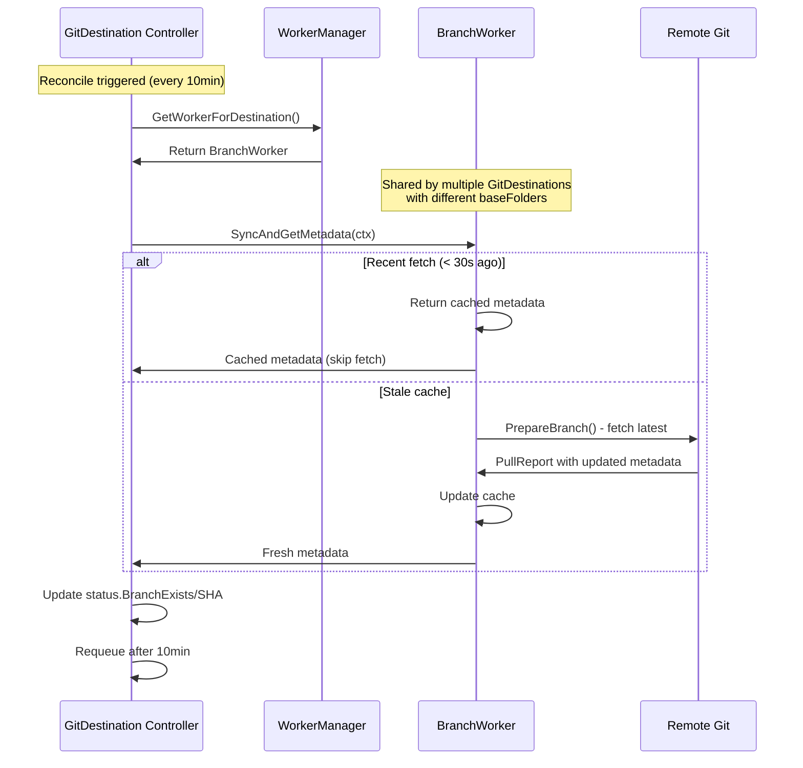

# GitDestination Synchronous Reconciliation Refactor

## Architectural Constraint

**IMPORTANT:** Uniqueness is enforced on **(repo, branch, baseFolder)** triple:
- Multiple GitDestinations CAN share the same (repo, branch)
- BUT each must have a DIFFERENT baseFolder
- Enforced by webhook validator using `SHA256(repoURL + branch + baseFolder)`

This design enables:
- Multiple teams/namespaces writing to different folders in same branch
- Shared BranchWorker per (repo, branch) serving multiple GitDestinations
- Each GitDestination isolated to its baseFolder within the shared branch

**Example Valid Configuration:**
```yaml
# team-a writes to "clusters/team-a" in main branch
GitDestination: team-a-dest
  branch: main
  baseFolder: clusters/team-a

# team-b writes to "clusters/team-b" in main branch
GitDestination: team-b-dest
  branch: main
  baseFolder: clusters/team-b
```

## Problem Statement

Currently, there's a design inconsistency between the BranchWorker and GitDestination controller:

**Current Architecture (Async):**
- [`BranchWorker`](../internal/git/branch_worker.go:230-274) syncs with remote every **1 minute** via `syncTicker`
- [`GitDestinationReconciler`](../internal/controller/gitdestination_controller.go:132) reconciles every **10 minutes** and reads **cached** metadata
- This creates a disconnect: fresh data every 1 minute but status updates only every 10 minutes

**Issues:**
1. GitDestination status can be up to 9 minutes stale
2. BranchWorker runs timers even when no active reconciliation is happening
3. Violates Kubernetes reconciliation pattern (work should happen during reconcile, not on independent timers)
4. Two separate timers (`pushTicker` and `syncTicker`) increase complexity

## Proposed Solution

**Synchronous Reconciliation Pattern:**
- GitDestination controller triggers sync during reconcile
- BranchWorker provides synchronous `SyncAndGetMetadata()` method
- Status always reflects current Git state
- Follows standard Kubernetes controller patterns (FluxCD, ArgoCD, cert-manager)
- **30s cache optimization** prevents redundant fetches when multiple GitDestinations share a branch

### Architecture Diagram



## Implementation Steps

### 1. Add SyncAndGetMetadata() to BranchWorker

**File:** `internal/git/branch_worker.go`

Add new method that returns existing `*PullReport` type:

```go
// SyncAndGetMetadata fetches latest metadata from remote Git repository.
// Uses caching to avoid redundant fetches within 30 seconds (optimization for
// multiple GitDestinations sharing the same branch).
// Returns PullReport containing branch existence, HEAD SHA, and other metadata.
func (w *BranchWorker) SyncAndGetMetadata(ctx context.Context) (*PullReport, error) {
    w.metaMu.RLock()
    // Use cached data if fetched recently (< 30 seconds ago)
    if time.Since(w.lastFetchTime) < 30*time.Second {
        // Return cached metadata as a minimal PullReport
        report := &PullReport{
            ExistsOnRemote: w.branchExists,
            HEAD: BranchInfo{
                Sha:       w.lastCommitSHA,
                ShortName: w.Branch,
                Unborn:    w.lastCommitSHA == "",
            },
            IncomingChanges: false, // No fetch occurred
        }
        w.metaMu.RUnlock()
        w.Log.V(1).Info("Using cached metadata", "age", time.Since(w.lastFetchTime))
        return report, nil
    }
    w.metaMu.RUnlock()

    // Cache is stale, fetch fresh data
    w.Log.Info("Fetching fresh metadata from remote")
    report, err := w.syncWithRemote(ctx)
    if err != nil {
        return nil, fmt.Errorf("failed to sync with remote: %w", err)
    }

    // Return fresh PullReport (metadata already updated by syncWithRemote)
    return report, nil
}
```

### 2. Remove Periodic Sync Timer from BranchWorker

**File:** `internal/git/branch_worker.go`

**Remove from `processEvents()` (lines ~230-274):**

```go
// DELETE THIS:
// Setup periodic sync to detect external changes (1 minute default)
syncInterval := w.getSyncInterval()
syncTicker := time.NewTicker(syncInterval)
defer syncTicker.Stop()
```

**Remove from select statement:**

```go
// DELETE THIS:
case <-syncTicker.C:
    // Periodic sync to detect external changes to the repository
    if report, err := w.syncWithRemote(w.ctx); err != nil {
        w.Log.Error(err, "Failed to sync with remote")
    } else if report.IncomingChanges {
        w.Log.Info("External changes detected, metadata updated",
            "branch", report.HEAD.ShortName,
            "newSHA", report.HEAD.Sha)
        // Note: Full reconciliation trigger would go here in future
        // For now, metadata is updated which is sufficient
    }
```

**Remove method (lines ~398-410):**

```go
// DELETE THIS METHOD:
func (w *BranchWorker) getSyncInterval() time.Duration {
    // ...entire method...
}
```

### 3. Update GitDestination Controller

**File:** `internal/controller/gitdestination_controller.go`

Replace [`updateRepositoryStatus()`](../internal/controller/gitdestination_controller.go:364-401):

```go
// updateRepositoryStatus synchronously fetches and updates repository status.
func (r *GitDestinationReconciler) updateRepositoryStatus(
    ctx context.Context,
    dest *configbutleraiv1alpha1.GitDestination,
    _ *configbutleraiv1alpha1.GitRepoConfig,
    log logr.Logger,
) {
    log.Info("Syncing repository status from remote")

    // Get the branch worker for this destination
    repoNS := dest.Spec.RepoRef.Namespace
    if repoNS == "" {
        repoNS = dest.Namespace
    }

    worker, exists := r.WorkerManager.GetWorkerForDestination(
        dest.Spec.RepoRef.Name, repoNS, dest.Spec.Branch,
    )

    if !exists {
        // Worker not yet created - this is normal during initial reconciliation
        log.V(1).Info("Worker not yet available, will update status on next reconcile")
        return
    }

    // SYNCHRONOUS: Block and fetch fresh metadata (or use 30s cache)
    report, err := worker.SyncAndGetMetadata(ctx)
    if err != nil {
        log.Error(err, "Failed to sync repository metadata")
        // Don't fail reconcile, just skip status update
        return
    }

    // Update status with FRESH data from PullReport
    dest.Status.BranchExists = report.ExistsOnRemote
    dest.Status.LastCommitSHA = report.HEAD.Sha
    dest.Status.LastSyncTime = &metav1.Time{Time: time.Now()}

    log.Info("Repository status updated from remote",
        "branchExists", report.ExistsOnRemote,
        "lastCommitSHA", report.HEAD.Sha,
        "incomingChanges", report.IncomingChanges)
}
```

### 4. Keep GetBranchMetadata() for Backward Compatibility

**File:** `internal/git/branch_worker.go`

Keep existing method unchanged (used by other components):

```go
// GetBranchMetadata returns current branch status without syncing.
// This is now primarily used for quick status checks without triggering Git operations.
func (w *BranchWorker) GetBranchMetadata() (bool, string, time.Time) {
    w.metaMu.RLock()
    defer w.metaMu.RUnlock()
    return w.branchExists, w.lastCommitSHA, w.lastFetchTime
}
```

### 5. Update Tests

**Files to Update:**
- `internal/git/branch_worker_test.go`
- `internal/controller/gitdestination_controller_test.go`

**Test Scenarios:**

1. **Test SyncAndGetMetadata() with fresh fetch:**
   - Call `SyncAndGetMetadata()`
   - Verify Git operations occurred
   - Verify metadata is correct

2. **Test SyncAndGetMetadata() with cached data:**
   - Call `SyncAndGetMetadata()` twice within 30 seconds
   - Verify second call uses cache (no Git operations)

3. **Test multiple GitDestinations sharing branch (with different baseFolders):**
   - Simulate multiple GitDestinations reconciling same branch
   - Verify only one Git fetch occurs within 30s window (due to caching)
   - Verify each GitDestination gets same metadata

4. **Test error handling:**
   - Simulate Git fetch failure
   - Verify error is properly returned and logged

### 7. Verify E2E Tests

**File:** `test/e2e/e2e_test.go`

Run full e2e test suite:
```bash
make test-e2e
```

Verify:
- GitDestination status updates correctly
- No regressions in commit behavior
- Proper handling of branch creation/deletion

## Benefits

| Aspect | Before (Async) | After (Sync) |
|--------|---------------|--------------|
| Status Freshness | Up to 9 min stale | Always current |
| Complexity | 2 timers (push + sync) | 1 timer (push only) |
| K8s Pattern | ❌ Non-standard | ✅ Standard pattern |
| Git Operations | Every 1 min (unconditional) | Every 10 min (on-demand) |
| Multi-GitDest Sharing | No optimization | 30s cache (shared branch) |
| Architecture | Async timers | Sync controller-driven |

## Rollback Plan

If issues arise, revert by:

1. Remove `SyncAndGetMetadata()` method
2. Restore `syncTicker` and `getSyncInterval()`
3. Restore original `updateRepositoryStatus()` implementation
4. Revert all test changes

All changes are contained within:
- `internal/git/branch_worker.go`
- `internal/controller/gitdestination_controller.go`
- Test files

## References

- Current BranchWorker: [`internal/git/branch_worker.go`](../internal/git/branch_worker.go)
- Current GitDestination Controller: [`internal/controller/gitdestination_controller.go`](../internal/controller/gitdestination_controller.go)
- Git Abstractions: [`internal/git/abstraction.go`](../internal/git/abstraction.go)
- Controller Constants: [`internal/controller/constants.go`](../internal/controller/constants.go)

## Validation

Before considering complete:

- [ ] `make lint` passes
- [ ] `make test` passes with >90% coverage
- [ ] `make test-e2e` passes
- [ ] No regressions in GitDestination status updates
- [ ] Multiple GitDestinations on same branch work correctly
- [ ] Error cases are handled gracefully