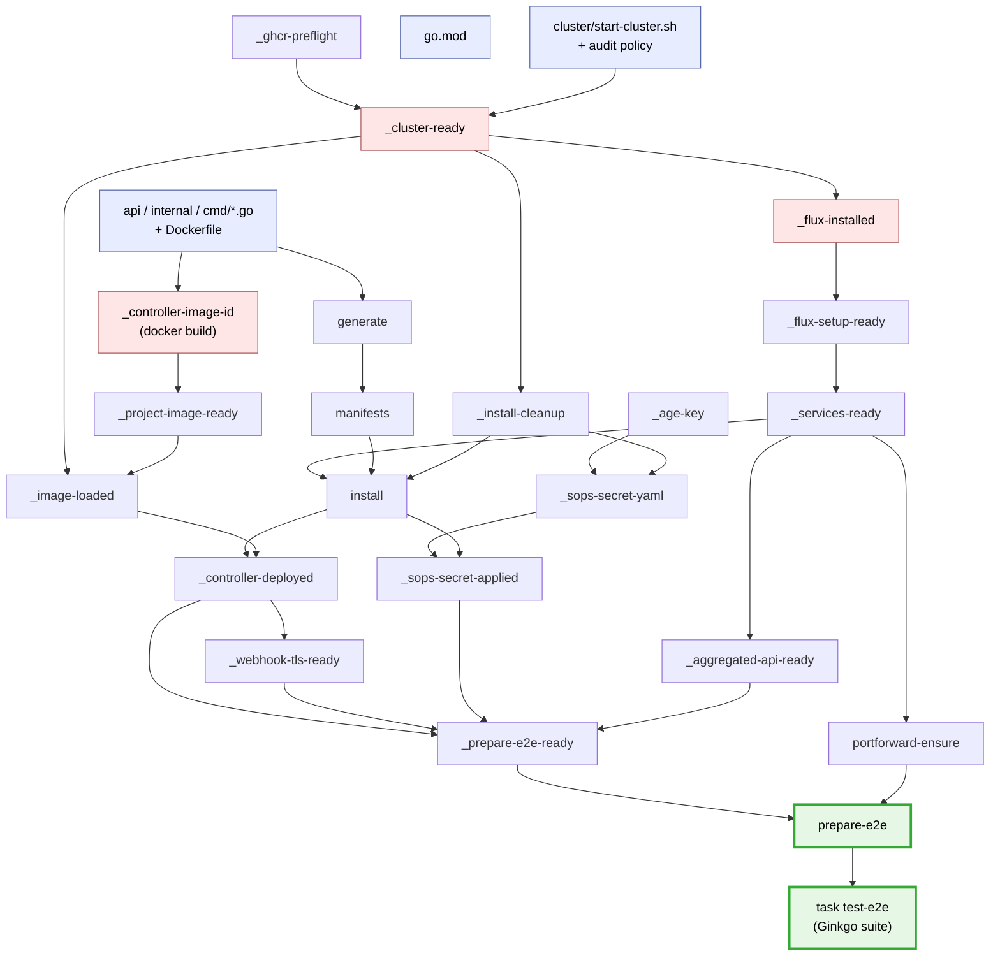
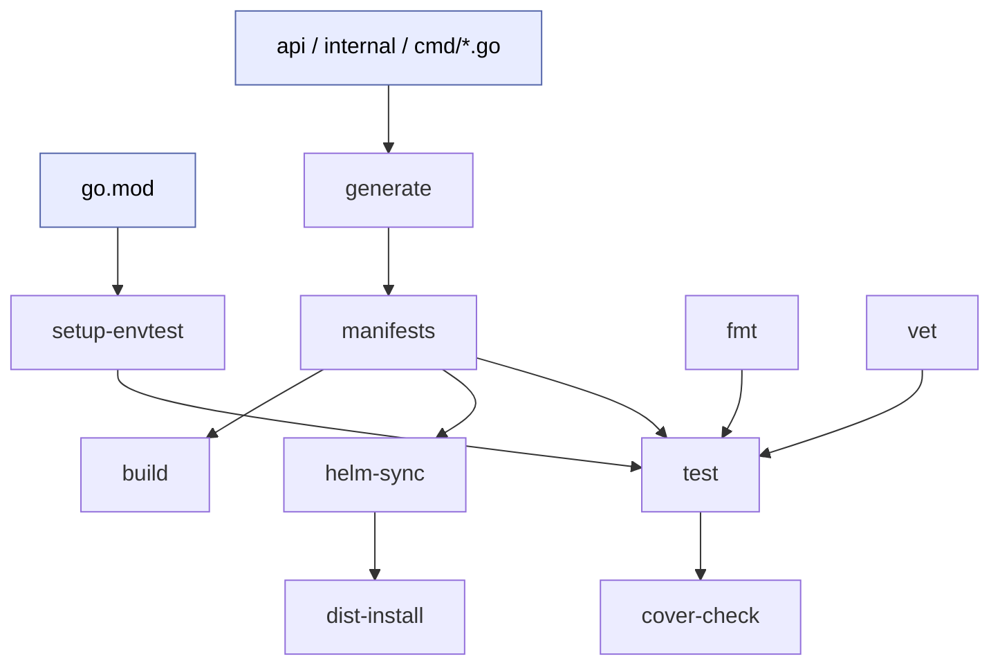

# Tasks Overview

This repository drives codegen, build, unit tests, and the full e2e bring-up through
[Task](https://taskfile.dev) (`task`) instead of a `Makefile`.

The Taskfiles encode a dependency graph (DAG). Every step from source files to a working
build, and then to a running controller under e2e, is expressed as a task with explicit
`sources`, `generates`, and `deps`. Task only re-runs the steps whose inputs changed, so a
routine edit usually waits for one small rebuild instead of a six-minute cold cluster.

> **New to Task?** Start with the official docs at [taskfile.dev](https://taskfile.dev/docs)
> for syntax and concepts. This repo also follows the upstream
> [Task styleguide](https://taskfile.dev/docs/styleguide); the [Best practices](#best-practices)
> below are our project-specific additions on top of it.

## Why not a Makefile

Make could express this, but for me it became to much of hassle every time. In the end I learned about things like  `.ONESHELL`, `.SECONDEXPANSION`, grouped targets, and recursive `$(MAKE)` calls. It's all very powerfull but for me it's all a bit to much.

Task keeps the behavior easier to follow:

- **Clean YAML.** `desc`/`sources`/`generates`/`deps` are declared up front, it's boring in the good way.
- **A clear DAG.** [Dependencies](https://taskfile.dev/docs/guide#task-dependencies) are explicit and visible, so the e2e flow reads top-to-bottom
  instead of being reconstructed from prerequisite tricks.
- **[Fingerprinting support](https://taskfile.dev/docs/guide#prevent-unnecessary-work), kept on purpose.** Task orchestrates; `.stamps` hold the runtime
  facts as files (cluster ready, image loaded) that a checksum cache shouldn't own. Helper scripts under
  `hack/e2e/` still do the detailed work.

## File layout

- [Taskfile.yml](../Taskfile.yml): small root entrypoint. It `includes` the other two with
  `flatten: true` so everything shares one flat command surface, and sets `run: once` so the
  e2e DAG can fan out through `deps:` without a shared node starting twice.
- [Taskfile-build.yml](../Taskfile-build.yml): build, codegen, lint, and unit-test tasks.
- [test/e2e/Taskfile.yml](../test/e2e/Taskfile.yml): the e2e bring-up DAG.

Run `task` (or `task help`) to list everything.

## Most important tasks

| Task | What it does | When to run it |
| --- | --- | --- |
| `task test` | Regenerates manifests + deepcopy, runs `go fmt`/`go vet`, sets up envtest, runs all non-e2e packages, then the coverage ratchet (`cover-check`). | Before every commit. |
| `task lint` | `golangci-lint run`. | Before every commit. |
| **`task test-e2e`** | Builds the controller image, brings up k3d + Flux + services, installs and deploys the controller, then runs the Ginkgo suite against it. The suite's before-hook invokes `task prepare-e2e`, so this one command walks the entire DAG below. | Before every commit that changes behavior. Needs Docker running. |
| `task prepare-e2e` | Runs the bring-up/deploy half of the DAG, without specs. | Rarely by hand; it's what Tilt and the suite call. |
| **`task clean-cluster`** | Deletes the k3d cluster and removes its stamps (`.stamps/cluster/<ctx>/`). Forces the entire cluster subtree to rebuild cold (~5–6 min) next run. | **Only when your cluster is broken**, or when you deliberately want a cold, slow, from-scratch run. Not part of the normal loop. |
| `task clean` | Removes `bin/`, `cover.out`, `dist/`, and **all** of `.stamps/` (including the image and envtest caches). | A full local reset. |
| `task manifests` / `task generate` | Regenerate CRDs/RBAC/webhook config and deepcopy code. | Usually automatic; other tasks depend on them. |
| `task build` | Compile `bin/manager`. | When you want the local binary. |

`task clean-cluster` is the one to reach for when the e2e cluster is wedged. It only wipes
`.stamps/cluster/<ctx>/`, so the **controller image cache (`.stamps/image/`) survives**. The
next run rebuilds the cluster but reuses the image unless the Go sources changed.

## The dependency chain (DAG)

This is the chain from source files to a controller running under the e2e suite. Arrows point
from an input to the step it triggers. Read it top-down: change something at the top, follow
the arrows, and see what re-runs.

Some details in that graph matter for day-to-day work:

- **Two branches start from the same Go sources and run in parallel.** Editing a `.go` file
  invalidates *both* `manifests` (codegen) and `_controller-image-id` (the docker build) at
  once; they run concurrently, then rejoin at the install/deploy steps.
- **The cluster spine is deliberately linear and slow.** `_cluster-ready` →
  `_flux-installed` → `_flux-setup-ready` → `_services-ready` is the expensive part
  (highlighted red). Everything downstream reuses it as long as its `sources` (the
  cluster/Flux setup files) don't change.
- **`_prepare-e2e-ready` is a barrier.** It waits on the deployed controller, its webhook
  TLS, the applied SOPS secret, and the aggregated-API server. Those are the four things a
  spec needs before it can run.
- **`task test-e2e` is the entrypoint, not a graph dependency.** You run `task test-e2e`; its
  Ginkgo `SynchronizedBeforeSuite` shells out to `task prepare-e2e`
  ([e2e_suite_test.go](../test/e2e/e2e_suite_test.go)), which is what actually walks the DAG,
  exactly once, before the specs execute against the prepared cluster.

The unit/build side is a much smaller graph rooted at the same codegen:

## Why the DAG pays off: only what changed re-runs

Because each task declares its real inputs and outputs, Task skips any step already up to
date. The practical effect, edit by edit:

| You change | What re-runs | What stays warm |
| --- | --- | --- |
| A controller `.go` file (`internal/…`) | codegen check + **image rebuild** → reload → redeploy → suite | cluster, Flux, services, age key, install-cleanup |
| An API type (`api/v1alpha3/…`) | `generate` → `manifests` → `helm-sync`, **and** image rebuild → redeploy | the whole cluster/Flux spine |
| Only a `*_test.go` file | just the `go test` / Ginkgo run; test files are `exclude`d from image and manifest `sources` | image, deploy, cluster; no rebuild at all |
| `cluster/start-cluster.sh` or the audit policy | `_cluster-ready` invalidates → **everything downstream** re-runs (cold, ~5–6 min) | nothing; this is the expensive case |
| `go.mod` | `setup-envtest` (new envtest assets) + image rebuild | cluster/Flux |
| *Nothing* (re-run `task test-e2e`) | just the specs; every stamp is up to date, so the cluster is ready in seconds | everything |

That bottom row is the main benefit: a warm re-run of the full e2e suite skips the entire
bring-up graph. The row to respect is the cluster-script change; it is equivalent to a
`clean-cluster` in cost, because it invalidates the root of the spine.

## The `.stamps` model

Task's own checksum cache can't observe whether the k3d cluster is actually alive, so we keep
explicit stamp files for the runtime facts, and let Task's `sources`/`generates` handle the
file-derived ones. The layout:

- `.stamps/cluster/<ctx>/`: cluster-scoped readiness: `ready`, `flux.installed`,
  `flux-setup.ready`, `services.ready`, `aggregated-api.ready`, `image.loaded`,
  `ghcr-preflight.ok`, `age-key.txt`, and a per-namespace `<ns>/` subdir with
  `install.yaml`, `controller.deployed`, `webhook-tls.ready`, `sops-secret.applied`, and the
  final `prepare-e2e.ready`. **`task clean-cluster` removes this tree.**
- `.stamps/image/`: the controller image cache: `controller.id`, `controller.cover`,
  `project-image.ready`. Survives `clean-cluster`; removed by `task clean`.
- `.stamps/envtest-<version>.ready`: the downloaded envtest binaries marker.

Many stamp tasks also carry a `status:` block that probes the live cluster (e.g. "does the
`fluxinstance` still exist?"), so a stamp left over from a deleted cluster is correctly
treated as out of date rather than trusted blindly.

## Best practices

Start from the official [Task styleguide](https://taskfile.dev/docs/styleguide). This repo
follows it: two-space indent, `UPPERCASE` variable names, `kebab-case` task names, and complex
logic pushed into external scripts (ours live under `hack/e2e/`) rather than long inline `cmds:`.

On top of that, four project-specific rules keep the graph fast and readable, each already
visible throughout the Taskfiles:

### 1. Prefer `deps:` over calling tasks by hand

Declare what a task needs in `deps:` and let Task order and dedupe the work. With `run: once`
set at the [root](../Taskfile.yml), a shared node like `_cluster-ready` runs exactly once even
when it's reached through the image branch *and* the install branch. Dependencies are also
visible in the graph and can run in parallel; an imperative `task:` call buried in `cmds:` is
neither. So `deps:` is the default.

Reach for a sequential `cmds:` → `task:` call only when the ordering itself is the point. For
example, `prepare-e2e` runs `portforward-ensure` *after* the ready barrier because a webhook
TLS step restarts the k3d server and would kill port-forwards started concurrently. `install`
also dispatches to `install-{{.INSTALL_MODE}}` by variable. Those are the exceptions, not the
pattern.

### 2. Keep tasks small

A small task has a precise up-to-date check, so an edit invalidates the minimum. When a step
is shared, give it its own node instead of inlining it. `_install-cleanup` was lifted out of
the top of every `_install-<mode>` task into a standalone node precisely so it could be a
single prerequisite for both the active install *and* `_sops-secret-yaml`,
which writes into the same namespace dir. Small nodes cache better and compose better.

### 3. Let every cache-worthy task deliver a file

Task decides whether to skip work by comparing `sources` against `generates`, so give each
such task a concrete output:

- a real artifact where one exists: `manifests` generates `config/crd/bases/*.yaml`,
  `generate` produces `zz_generated.deepcopy.go`;
- an explicit `.stamps/…` marker where the "output" is really a runtime fact:
  `_cluster-ready` touches `.stamps/cluster/<ctx>/ready`, `_image-loaded` touches
  `image.loaded`.

Without a delivered file a task can neither be skipped nor gate a downstream `sources:` edge.
When the file stands in for live state, back it with a `status:` probe (e.g. "does the
`fluxinstance` still exist?") so a stamp left over from a deleted cluster is correctly treated
as stale rather than trusted.

### 4. Prefix internal tasks with `_`

Public, day-to-day commands stay unprefixed: `test`, `lint`, `test-e2e`, `clean-cluster`.
Anything you only expect to be reached *through* the graph gets a leading underscore:
`_cluster-ready`, `_image-loaded`, `_prepare-e2e-ready`. It keeps `task --list` focused on the
commands people actually type, and the `_` is a clear signal: "you normally get here via a
dependency, not by running it directly." If you're unsure whether a task is day-to-day, prefix
it; promoting it later is cheaper than a cluttered command surface.

## What this gives us

Task gives the repo a clearer command surface, a readable e2e flow, and declarative build
tasks while keeping explicit `.stamps` state where it still matters. Accurate
`sources`/`generates`/`deps` mean routine edits trigger minimal, correct rebuilds, which keeps
the local development loop fast.
