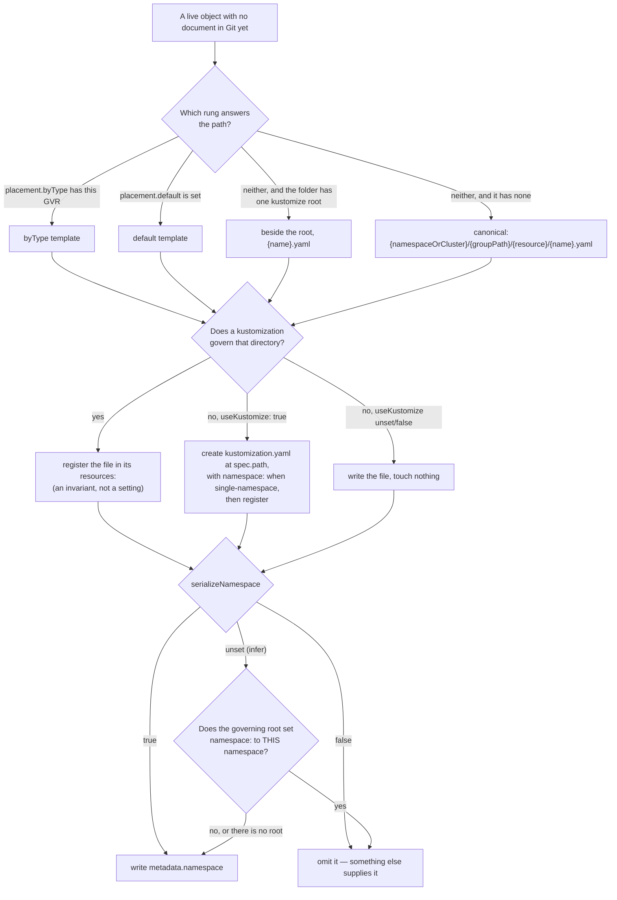
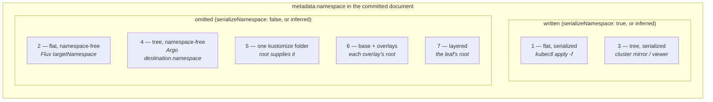

# The folder shapes, and the configuration each one needs

> **design**: a specification by example for the layout model in
> [`../model.md`](../../../../docs/layout/model.md). Both booleans shown here, `spec.serializeNamespace` and
> `spec.placement.useKustomize`, are shipped fields, and every folder below is executed against
> the write path by the layout corpus.
> Date: 2026-08-31.
> Index: [`../../INDEX.md`](../../../../docs/INDEX.md)

[`../specific-examples/`](../specific-examples/README.md) answers *"what does this look like in
Argo CD, or in Flux?"* This folder answers the question underneath it: **what
are the folder shapes a repository can have, and what does a `GitTarget` have to say to produce each
one?** The shapes are the cross-product that matters, not a list of use cases, and the same
live object is written into all of them so the only thing that differs between two folders is the
configuration that produced them.

Every shape receives the same input, [`checkout-config.yaml`](1-flat-serialized/input/checkout-config.yaml):
a `ConfigMap` named `checkout-config` in namespace `shop`. Each folder holds `config/`,
`repository/` (the starting state), `input/`, and `expected-*.patch` — the same conventions as
[`../specific-examples/README.md`](../specific-examples/README.md), including patches without
`index` lines and a `repository/` rooted at the repository root rather than at `spec.path`.

| # | Shape | `useKustomize` | `serializeNamespace` | Placement template |
|---|---|---|---|---|
| [1](1-flat-serialized/README.md) | Flat, namespaces serialized | — | `true` | `"{namespace}-{name}.yaml"` |
| [2](2-flat-namespace-free/README.md) | Flat, namespace-free | — | `false` | `"{name}.yaml"` |
| [3](3-tree-serialized/README.md) | Tree, namespaces serialized | — | `true` | none — built-in canonical |
| [4](4-tree-namespace-free/README.md) | Tree, namespace-free | — | `false` | `"{resource}/{name}.yaml"` |
| [5](5-kustomize-single-folder/README.md) | One kustomize folder | — / `true` | unset / `false` | none |
| [6](6-kustomize-base-and-overlays/README.md) | Base + three environment overlays | — | unset | none |
| [7](7-kustomize-layered/README.md) | Layered kustomize | — | unset | none |
| [8](8-base-owned-field-edit/README.md) | Editing a field the **base** owns | — | unset | none — **write path, not placement** |

Scenario 8 is not an eighth folder shape: it is shape 6's repository with the question changed from
*where does a new file go* to *what happens when the changed field belongs to the base*. It sits in
this table because it is the property that makes the kustomize shapes safe to point at a real
repository, and because it is the first thing anyone asks after the placement question.

A dash means the flag is not set and does not need to be. **Shapes 3, 5, 6 and 7 need no layout
configuration at all** — 3 is what the built-in ladder does with no template, and 5–7 are what it
does when the folder has a kustomize root. The flags exist for the other three columns of the
matrix: a flat folder (which is a *declared* shape, never an inferred one), a namespace-free folder
whose supplier is outside the repository, and an empty folder, where there is nothing to infer from.

## How a write decides

Two independent questions, which is the whole argument for two booleans rather than one `layout`
discriminator. The path decides nothing about the bytes, and the bytes decide nothing about the
path.

The inference branch is the one worth reading twice: it omits the namespace **only** when a
governing root sets it to this resource's own namespace. In every other case it writes it, because
omitting it there would hand the document to a different namespace. That is why `false` is an
override of a correctness rule and needs a guard, while unset does not — and why unset cannot simply
be spelled `false`.

## Where the shapes sit

The split is not flat-versus-tree and it is not kustomize-versus-not. It is **who supplies the
namespace**, and there are exactly three answers: the document itself, a `kustomization.yaml` in the
repository, or a deployer outside it. Only the middle one is something the operator can see, which
is the fault line the whole `serializeNamespace` guard runs along.

## Pointing each shape at an empty folder

This is the column the refactor is for. "The folder is empty" removes the one thing inference reads,
so every shape that relied on inference has to be *declared* instead.

| Shape | Empty folder, today | What makes it work |
|---|---|---|
| 1 — flat, serialized | **Works.** No root is needed; inference writes the namespace anyway | nothing — but declare `serializeNamespace: true` to pin it |
| 2 — flat, namespace-free | **Works, unverifiably.** Nothing in the repository supplies the namespace, and nothing ever will | `serializeNamespace: false` plus an out-of-band supplier the operator cannot see. Not a fault. See below |
| 3 — tree, serialized | **Works.** The canonical path needs no context | nothing |
| 4 — tree, namespace-free | **Broken**, same reason as 2 | same as 2 |
| 5 — one kustomize folder | **Broken today**: no root exists, so nothing is registered and nothing renders | `placement.useKustomize: true` — the operator writes the root, `namespace:` included |
| 6 — base + overlays | **Half.** `useKustomize` creates a *standalone* root, not an overlay | see the gap below |
| 7 — layered | **Half**, same as 6 | see the gap below |

Three findings come out of that column, and they are the substance of this document.

**Shape 5 is the case `useKustomize` was designed for.** An empty folder plus `useKustomize: true`
plus `serializeNamespace: false` produces a kustomize folder from the first commit: the operator
writes the `kustomization.yaml`, adopts whatever is already there into its `resources:`, and leaves
`metadata.namespace` out of every document it places. The created root carries no `namespace:`
either — the artifact does not encode its deployment namespace, and the installer supplies it, the
same way it does for shapes 2 and 4 (see
[`../../design/created-root-namespace.md`](../../../../docs/design/created-root-namespace.md)).
[`5-kustomize-single-folder`](5-kustomize-single-folder/README.md) shows both halves — the same
folder adopted and created — and they differ by two lines of spec.

**Shapes 2 and 4 have no such proof, and that is not a gap — it is the shape.** Their supplier is a
Flux `Kustomization.spec.targetNamespace` or an Argo `Application.spec.destination.namespace` living
in a different cluster from the repository. It is a perfectly ordinary way to run GitOps — it is
what makes a folder portable, and two deployers may point at the same folder and land it in two
different namespaces, both correctly.

So there is **no post-scan supplier guard**, and no field naming the supplier either: a rule keyed on
the folder's own contents would fire on the intended use, and an assertion field would ask the user
to promise something that is not theirs to promise and that nothing could check. The line the model
draws instead is **guard what is inside the folder, say nothing about what happens after it
leaves** — which is why the one-source-namespace rule below is enforced and this one does not exist.
See
[`model.md`](../../../../docs/layout/model.md#why-false-needs-no-guard).

**Shapes 6 and 7 cannot be bootstrapped from empty, and the reason is not a missing flag.** An
overlay is not a root plus a namespace; it is a root whose `resources:` names a *relative path to a
base* — `../../base`. The operator has no way to know that path, because no live object mentions it.
`useKustomize: true` pointed at an empty `overlays/prod` writes a self-contained root that renders
only the documents the operator itself places, which is a different folder from the one the user
wanted and renders green. **Creating an overlay is a scaffolding operation, not a placement one**,
and it belongs to a repository template or the onboarding CLI rather than to this flag. Worth saying
in the field documentation, because "create the kustomization.yaml" sounds like it covers this and
does not.

## What the consumers actually do

Four ecosystem facts, checked against the upstream source in `external-sources/` rather than
recalled, because three of the shapes are only safe if they hold.

- **`kubectl apply -f <dir>` does not descend into subdirectories.** It reads the files in that one
  directory; `--recursive`/`-R` is what walks the tree. So shape 1 (flat) is the shape that survives
  a plain `kubectl apply -f`, and shapes 3 and 4 need `-R`. This is the honest answer to "is a tree
  useful with `kubectl apply -f`" — it is, with one more character.
- **Flux generates a root when the path has none, and it walks recursively.** `kustomize-controller`
  looks for a `kustomization.yaml` at `spec.path`; finding none, it walks the whole subtree, adds
  every `.yaml` it can parse as a resource, and — importantly — when a subdirectory has its own
  kustomization it adds *the directory* and stops descending. So shapes 1, 3 and 4 all deploy under
  Flux with no root in the repository, and a tree of nested roots is composed correctly rather than
  flattened.
- **Flux's `targetNamespace` is a kustomize `namespace:` transformer, so it overrides.** The
  generated or existing root gets `namespace: <targetNamespace>`, and a kustomize `namespace:`
  rewrites `metadata.namespace` on every namespaced document rather than filling in the blank ones.
  Two consequences: it is a genuine supplier for shapes 2 and 4, and it is **destructive** to shape
  3 — pointing a Flux `Kustomization` with a `targetNamespace` at a multi-namespace mirror collapses
  every namespace into one. `serializeNamespace: true` does not protect against it. A cluster mirror
  is consumed without a `targetNamespace`, or not at all.
- **Argo CD does not recurse by default.** `spec.source.directory.recurse` is a bool that defaults
  to false, so shape 4 needs it set as well as `destination.namespace`. Shape 1 needs neither.

The general rule those four facts add up to: **a namespace-free folder is only as safe as the
deployer that consumes it, and a multi-namespace folder is only safe if no deployer between it and
the cluster asserts a single namespace.** Shape 3's `serializeNamespace: true` is a statement about
this folder, not a defence against a transformer downstream.

## Why only a leaf can be a kustomize target

Shapes 6 and 7 are the same answer to a question asked twice: a `GitTarget` at
`apps/checkout/overlays/prod`, never at `apps/checkout`. Three separate rules land on it, and it is
worth seeing that they agree rather than that one of them is the rule.

- **The folder must have exactly one render root.** `apps/checkout` covers four roots in shape 6 and
  four in shape 7, which resolves to `LayoutResolved: Ambiguous` rather than to an arbitrary pick.
- **Fan-in must be one (L2).** A file more than one render root consumes is never written. This
  rule is what fires on the *wide* target specifically, and it is worth being precise about why:
  `renderRoots` counts a kustomization directory as a root when no other kustomization **in the
  scan** references it. A target at `apps/checkout` scans all four, so `base/` is referenced by
  three roots and every file in it is refused. A target at the leaf scans only `overlays/prod` and
  the base it reads, where the base is referenced by exactly one root — so from a leaf, **L2 never
  fires, and L1 is what keeps the base read-only**. The two rules cover different targets rather
  than doubling up.
- **A target is a write partition (Option A in the
  [granularity decision](../../../../docs/design/support-boundary/gittarget-granularity-and-cross-environment-edits.md)).**
  One overlay = one environment = one watch scope = one write scope, so that authorization, audit and
  review line up with the environment boundary. "Manage the app as one thing" is a grouping concern
  for a layer above the operator, not a wider target.

So three environments are three `GitTarget` objects, and the shared base or layer is read-only input
to all of them. What happens to an edit that lands on a base-owned field is
[scenario 8](8-base-owned-field-edit/README.md), and it is not one answer but two: `images:` and
`replicas:` become a declaration authored into the overlay, proven by re-rendering; everything else
is refused with `WriteBoundaryRefused` rather than redirected. A set of examples where every write
succeeds would be advertising rather than specifying, which is why both halves are fixtures.

## The viewer case

Shape 3 exists for a use that is not deployment at all: pointing GitOps Reverser at a cluster to
**see** what is in it, as reviewable documents with a Git history, and never applying the result.
That is why the tree stays, and it constrains two things. The path has to carry the identity — the
canonical `{namespaceOrCluster}/{groupPath}/{resource}/{name}.yaml` is what makes a folder browsable
without an index — and the document has to carry `metadata.namespace`, because a viewer reads one
file at a time and a file that means something different depending on its folder is not a record.

The same folder is also deployable with `kubectl apply -R`, which is a happy accident and not the
design goal. The design goal is that the folder is legible on its own.

## What this set sent back to the model

### A namespace-free folder needs a fence around "one namespace"

**Raised against [shape 2](2-flat-namespace-free/README.md), applies equally to
[shape 4](4-tree-namespace-free/README.md), and now decided.** Both shapes are single-namespace *by
construction* — no `{namespace}` in the template — but construction is not enforcement. Two
`WatchRule` objects may point at one `GitTarget`, and one of them may name a different
`sourceNamespace`. The folder then loses information two ways — silently, by applying one
namespace's objects into another, and destructively, when two same-named objects collapse onto one
namespace-less document. [Shape 2](2-flat-namespace-free/README.md#what-if-two-namespaces-reach-this-target)
works both through on its own fixtures.

**The answer is a rule, not a field: an explicit `serializeNamespace: false` admits exactly one
source namespace, and the second is refused.** The argument — why
no third boolean, why explicit `false` only, why `useKustomize: true` makes it mandatory rather than
optional, and where the refusal lives — is in
[`model.md`](../../../../docs/layout/model.md#the-second-guard-one-source-namespace-and-this-one-refuses) and is not
repeated here.

What belongs here is what it means **per shape**:

| Shape | `serializeNamespace` | Under the rule |
|---|---|---|
| [1](1-flat-serialized/README.md), [3](3-tree-serialized/README.md) | `true` | untouched — two source namespaces stay legal, which is the point of those shapes |
| [2](2-flat-namespace-free/README.md), [4](4-tree-namespace-free/README.md) | `false` | fenced: the second source namespace is refused rather than silently merged |
| [5](5-kustomize-single-folder/README.md) empty-folder half | `false` | fenced, and it is what lets `useKustomize` write `namespace:` into the root it creates |
| [6](6-kustomize-base-and-overlays/README.md), [7](7-kustomize-layered/README.md) | unset | untouched — inference is never constrained by the rule |

A tree of nested roots, legitimately multi-namespace *and* namespace-free, is the case **unset** is
for. It must not declare `false`, and the rule refusing that declaration is the point rather than a
limitation.

### Two more, carried in the sections above

- **`serializeNamespace: false` does not name its supplier, and nothing checks one.** Shapes 2 and 4
  have a guarantee the operator cannot see and that may not even be single, so any such check could
  only produce a false alarm on the intended use. See
  [Pointing each shape at an empty folder](#pointing-each-shape-at-an-empty-folder).
- **Creating an overlay is scaffolding, not placement.** `useKustomize` cannot invent a base
  reference, and the folder it would create renders green while being the wrong folder. See
  [shape 6](6-kustomize-base-and-overlays/README.md).

## What each shape reports, and what a delete does to it

`status.placement.mode` is the one field that separates the raw shapes from the kustomize ones, and
it is worth reading as the deletion table it really is. **Every shape above answers "where does a
new file go"; this answers "and what happens when it goes away".**

| Shape | `mode` | `renderRoot` | `readOnlyBases` | A delete removes… |
|---|---|---|---|---|
| [1](1-flat-serialized/README.md), [2](2-flat-namespace-free/README.md) | `Plain` | — | — | the file. Nothing else is touched |
| [3](3-tree-serialized/README.md), [4](4-tree-namespace-free/README.md) | `Plain` | — | — | the file. Empty directories are left behind |
| [5](5-kustomize-single-folder/README.md) | `KustomizeRoot` | `.` | — | the file **and** its `resources:` entry, in one commit |
| [6](6-kustomize-base-and-overlays/README.md), [7](7-kustomize-layered/README.md) at the leaf | `KustomizeOverlay` | `.` | `../../base` | the file and its entry — **unless the object is inherited**, see below |
| [6](6-kustomize-base-and-overlays/README.md), [7](7-kustomize-layered/README.md) at the wide path | *absent* | *absent* | — | nothing: the folder is `Ambiguous` and places nothing |
| [8](8-base-owned-field-edit/README.md) | `KustomizeOverlay` | `.` | `../../base` | as 6/7 — the scenario is an edit, not a delete |

Three things follow, and only the first is obvious:

- **In a `Plain` folder a delete is a file removal and nothing more.** No index to maintain, no
  render to re-prove. This is the shape where what you see in Git is all there is.
- **In a `KustomizeRoot` folder deleting the manifest is only half the delete.** An entry still
  naming a file that does not exist makes `kustomize build` fail, so the `resources:` entry goes in
  the same commit
  ([`dropKustomizationResource`](../../../../internal/git/plan_flush.go)). If the entry cannot be removed,
  nothing is committed: the re-render precondition rebuilds the tree and refuses rather than
  pushing a folder that does not build.
- **In a `KustomizeOverlay`, deleting an object the overlay INHERITS deletes nothing.** The document
  lives in the base, which is outside the write scope and shared with the other environments, so
  removing it would delete the object from every environment at once. Instead the operator authors
  a `$patch: delete` file into the overlay and names it in the overlay's `patches:`, and the
  re-render oracle proves the object leaves *this* overlay's render. The base is never touched.
  This is the single most surprising behaviour in the model, which is why `mode` is published: it
  is the field that tells you to expect it.

`spec.prune.mode` sits on top of all of this and decides whether a delete is attempted at all —
`Never` removes nothing, `OnEvent` (the default) mirrors an observed DELETE, `Always` additionally
lets a resync infer one. The table describes what happens once a delete is allowed through.

**To watch any of this happen before you commit to it, point a `GitTarget` at a scratch branch** and
read the commits it makes: the file removals, the `resources:` edits and the `$patch: delete` files
are all right there in a diff. That is the preview, and it is why neither `status.placement` nor
`spec.suspend` tries to be one — see
[`model.md`](../../../../docs/layout/model.md#previewing-a-target-point-it-at-a-scratch-branch).

## What this set does not cover

- **Secrets and encryption.** `{sensitiveSuffix}`, the SOPS naming convention, and the rule that a
  sensitive resource is never appended into an existing document are specified in
  [`../new-file-placement-rules.md`](../../../../docs/layout/new-file-placement-rules.md) and are orthogonal to the two
  flags.
- **Collisions.** Two objects resolving to one path append into a multi-document file; that is
  decided and shipped, and shape 1's `"{namespace}-{name}.yaml"` reaches it whenever a ConfigMap and
  a Service share a name.
- **A multi-namespace folder with namespace-free documents.** Fact 2 in [`../model.md`](../../../../docs/layout/model.md)
  proves nested roots make it renderable, and nobody has asked for it. Shape 4 is deliberately
  single-namespace, and the deferred question is whether `useKustomize` should ever create a nested
  root per directory.
